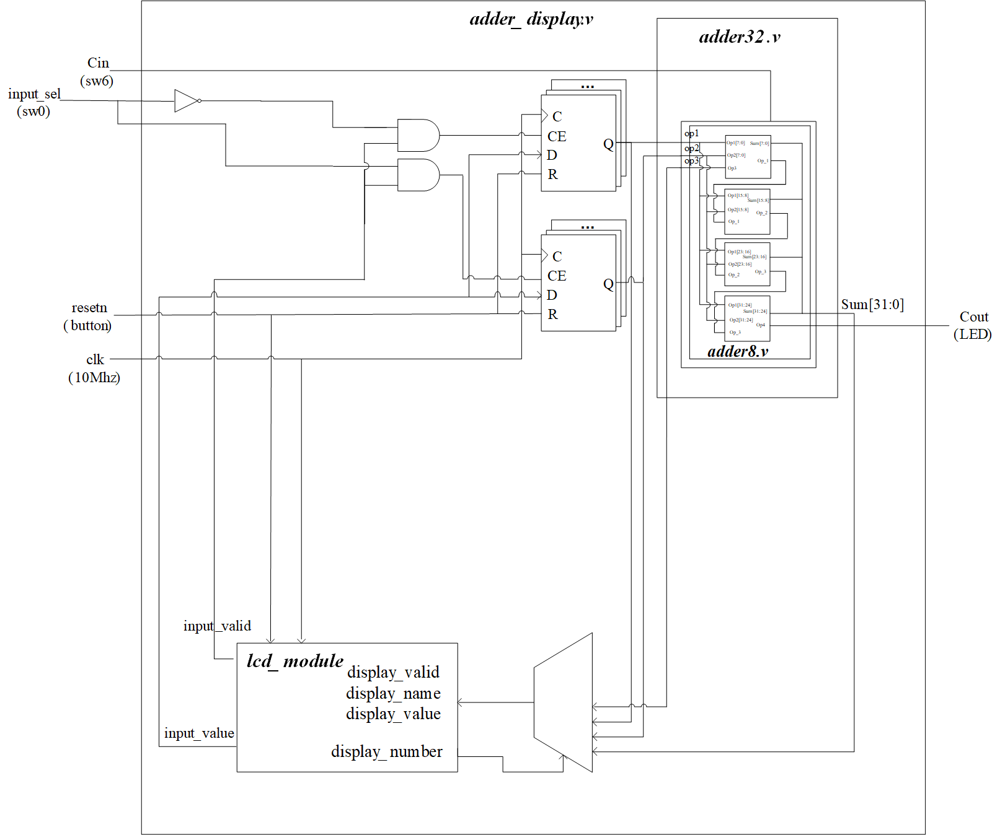

# <center>**组成原理课程第1次实验报告**</center>
## <center>**实验名称：**数据运算—定点加法&emsp;班级：李涛老师</center>
### <center>**学生姓名：刘修铭&emsp;&emsp;学号：2112492&emsp;&emsp;指导老师：董前琨**</center>
### <center>**实验地点：A306&emsp;&emsp;实验时间：2023.3.21&emsp;&emsp;**</center>


## 一、实验目的

1. 熟悉 LS-CPU-EXB-002 实验箱和软件平台。 

2. 掌握利用该实验箱各项功能开发组成原理和体系结构实验的方法。 

3. 理解并掌握加法器的原理和设计。 

4. 熟悉并运用 verilog 语言进行电路设计。 

5. 为后续设计 cpu 的实验打下基础。 


## 二、 实验内容说明

* 设计两个模块，8位加法器和32位加法器，其中32位加法器通过调用8位加法器实现；
  * 针对32位加法器进行仿真验证
  * 针对32位加法器进行上实验箱验证

## 三、实验原理图



## 四、实验步骤

### **（一）设计加法器**

* #### 编写 adder8.v 文件：

```verilog
module adder8(
    input [7:0] ina,
    input [7:0] inb,
    input inc,
    output [7:0] sum,
    output outc
    );
    assign {outc,sum} = ina + inb + inc;
    
endmodule
```
* #### 调用adder8模块编写 adder32.v 文件：

```verilog
module adder32(
    input [31:0] ina1,
    input [31:0] inb1,
    input inc1,
    output [31:0] sum1,
    output outc1
    );
    reg [31:0] op1,op2;
    reg op3;
    wire [31:0] sum;
    wire op_1,op_2,op_3,op4;

    adder8 a7_0(op1[7:0],op2[7:0],op3,sum[7:0],op_1);
    adder8 a15_8(op1[15:8],op2[15:8],op_1,sum[15:8],op_2);
    adder8 a23_16(op1[23:16],op2[23:16],op_2,sum[23:16],op_3);
    adder8 a31_24(op1[31:24],op2[31:24],op_3,sum[31:24],op4);
    
    assign {outc1,sum1} = ina1 + inb1 + inc1;
    
endmodule
```

1. 为避免与`adder8`模块中变量重名，将`adder32`模块中变量名后加1。
2. `op1`和`op2`分别用来保存输入的两个32位数，`op3`保存初始进位情况，`sum`保存求和后的32位数，`op_1`、`op_2`、`op_3`和`op4`则分别保存每次八位加和完后的进位情况。
3. 调用四次`adder8`模块，实现32位输入相加。


### **（二）仿真验证**

* #### 编写 testbench：
```verilog
module testbench();
reg [31:0] op1,op2;
reg op3;
wire [31:0] sum;

adder32 a(op1[31:0],op2[31:0],op3,sum[31:0]);

initial
begin
    op1=32'b0;
    op2=32'b0;
    op3=1'b0;
end

always #3 op1 = $random % 33'b1_0000_0000_0000_0000_0000_0000_0000_0000;
always #5 op2 = $random % 33'b1_0000_0000_0000_0000_0000_0000_0000_0000;
always #7 op3 = $random % 2'b1_0;

endmodule
```

1. 在testbench 里调用改后的 `adder32`模块 `adder32 a (op1[31:0],op2[31:0],op3,sum[31:0])` 。
2. 进行`op1`、`op2`和`op3`的初始化，修改随机产生代码。

### **（三）上实验箱验证**
1. 按照实验手册添加`adder_display`模块，并修改`ADD_1`、`ADD_2`、`RESUL`的显示位置。
```verilog
//-----{输出到触摸屏显示}begin
//根据需要显示的数修改此小节，
//触摸屏上共有44块显示区域，可显示44组32位数据
//44块显示区域从1开始编号，编号为1~44，
    always @(posedge clk)
    begin
        case(display_number)
            6'd4 :
            begin
                display_valid <= 1'b1;
                display_name  <= "ADD_1";
                display_value <= adder_operand1;
            end
            6'd5 :
            begin
                display_valid <= 1'b1;
                display_name  <= "ADD_2";
                display_value <= adder_operand2;
            end
            6'd6 :
            begin
                display_valid <= 1'b1;
                display_name  <= "RESUL";
                display_value <= adder_result;
            end
            default :
            begin
                display_valid <= 1'b0;
                display_name  <= 40'd0;
                display_value <= 32'd0;
            end
        endcase
    end
//-----{输出到触摸屏显示}end
```
* 将`ADD_1`输出到第4块显示区域。
* 将`ADD_2`输出到第5块显示区域。
* 将`RESUL`输出到第6块显示区域。
2. 添加`lcd_moudle`文件。
3. 添加`adder.xdc`约束文件。
4. 运行相关检查并上箱验证。

## 五、实验结果分析

* #### 仿真结果


以其中一个结果为例，验证其正确性：

加数一：`op1` = 0001 0010 0001 0101 0011 0101 0010 0100

加数二：`op2` = 0000 0000 0000 0000 0000 0000 0000 0000

进位：`op3` = 0

32 位结果：0001 0010 0001 0101 0011 0101 0010 0100

进位输出：0

经验证，结果正确。


* #### 上箱结果

#### （1）运算结果有进位溢出


##### 显示情况：

`ADD_1`：加数1 、`ADD_2`：加数2 、`RESULT`：结果

led灯那排左起第一个灯：进位

##### 验证正确性：

FFFFFFFF + 00000000 + 1 = 100000000

最后 `RESULT` 显示为 00000000，左起第一个灯灭，表示进位是 1，结果正确。


#### （2）运算结果无进位溢出


##### 显示情况：

`ADD_1`：加数1 、`ADD_2`：加数2 、`RESULT`：结果

led灯那排左起第一个灯：进位

##### 验证正确性：

FFFFFFFF + 00000000 + 0 = 0FFFFFFFF

最后 `RESULT` 显示为 FFFFFFFF，左起第一个灯亮，表示进位是 0，结果正确。


## 六、总结感想

1. 通过本次实验，熟悉了verilog的语法；
2. 明白了通过vivado进行实验的具体流程，为以后的实验打好了基础；
3. 实验中`adder_display` 模块中调用 lcd 触摸屏部分 里的实例化触摸屏部分， 和`adder.xdc` 约束文件中的绑定 lcd 触摸屏引脚部分代码较为复杂。给定源码的稳定性保证了实验的正常进行；
4. 学习了Visio Drawing的基本用法，为以后作图奠定基础。

