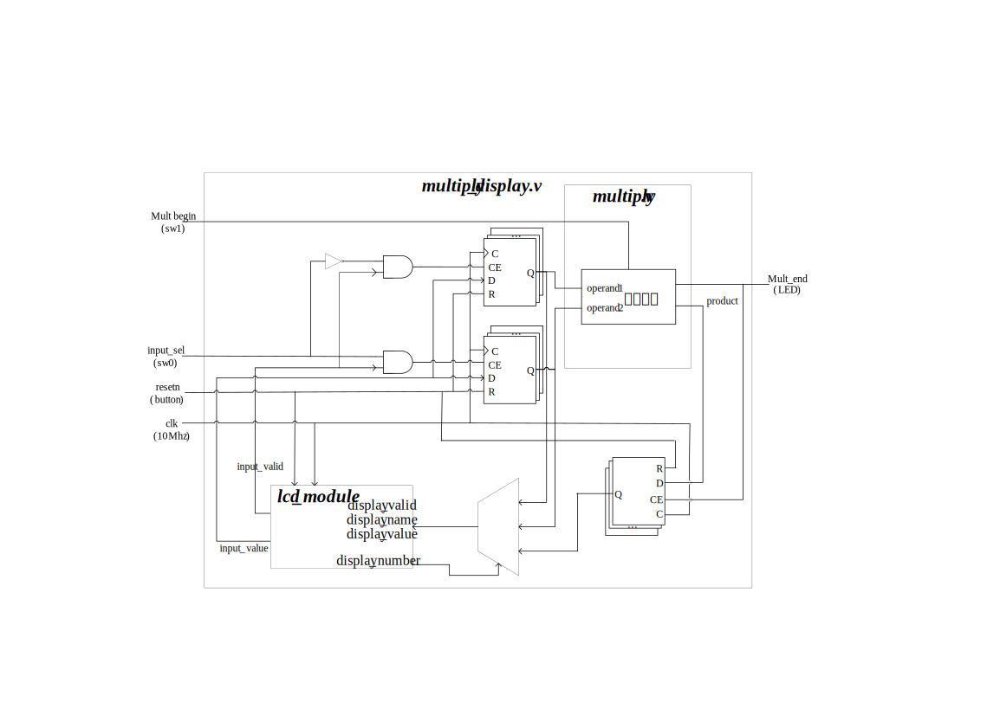
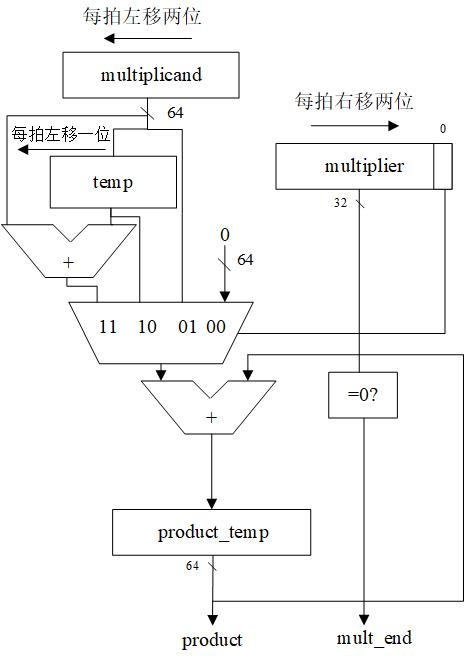
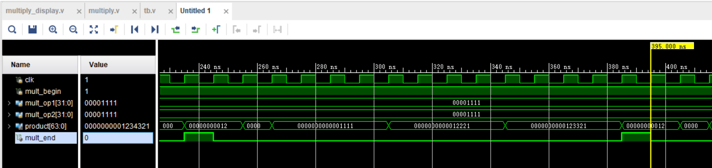
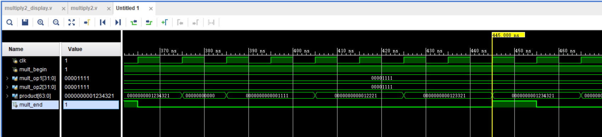
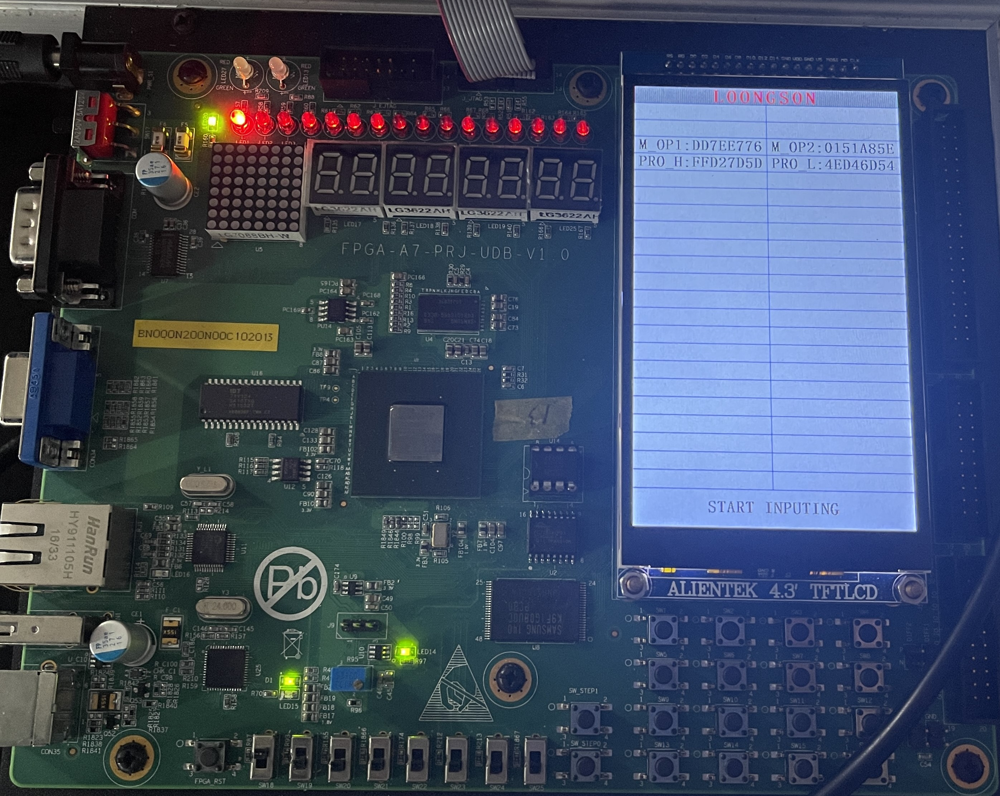
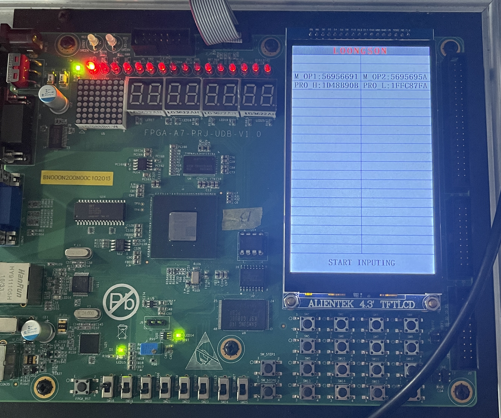

# <center>**组成原理课程第2次实验报告**</center>

## <center>**实验名称：**数据运算—定点乘法&emsp;班级：李涛老师</center>
### <center>**学生姓名：刘修铭&emsp;&emsp;学号：2112492&emsp;&emsp;指导老师：董前琨**</center>
### <center>**实验地点：A306&emsp;&emsp;实验时间：2023.4.4&emsp;&emsp;**</center>


## 一、实验目的

1. 理解定点乘法的不同实现算法的原理，掌握基本实现算法。 

2. 熟悉并运用 verilog 语言进行电路设计。 

3. 为后续设计 cpu 的实验打下基础。


## 二、 实验内容说明

* 复现定点乘法实验；
* 在原有迭代乘法的基础上，实现可以在16个时钟周期内完成计算的乘法器（即一次移两位）：
  * 作出改进后的迭代乘法的模块图；
  * 进行波形仿真，并分析是否完成在16个时钟周期内完成乘法计算的实验目标；
  * 修改实验箱显示屏上数值的显示位置；
  * 针对改进后的乘法器上箱验证；


## 三、实验原理图

* 顶层模块图

  

* 实验原理图

  


## 四、实验步骤
### **（一）复现定点乘法实验（每次移一位乘法器）**
此处按照实验指导手册操作即可，重复简单的复制粘贴工作，不再赘述。

### **（二）改进乘法器（修改 multiply.v 文件）**

1. ##### 修改被乘数和乘数每个时钟周期移动的位数

   * 被乘数每个时钟周期左移 2 位，即每次取`原被乘数的后62位`和`两个0位`拼接后构成新的64位被乘数。
   ```verilog
       //加载被乘数，运算时每个时钟周期左移两位
       reg  [63:0] multiplicand;
       always @ (posedge clk)
       begin
           if (mult_valid)
           begin    // 如果正在进行乘法，则被乘数每个时钟左移两位
               multiplicand <= {multiplicand[61:0],2'b00};
           end
           else if (mult_begin) 
           begin   // 乘法开始，加载被乘数，为乘数1的绝对值
               multiplicand <= {32'd0,op1_absolute};
           end
       end
   ```

   * 乘数每个时钟周期右移 2 位，即每次取`两个0位`和`原乘数的前30位`拼接后构成新的32位乘数。

   ```verilog
       //加载乘数，运算时每个时钟周期右移两位
       reg  [31:0] multiplier;
       always @ (posedge clk)
       begin
           if (mult_valid)
           begin   // 如果正在进行乘法，则乘数每个时钟右移两位
               multiplier <= {2'b00,multiplier[31:2]}; 
           end
           else if (mult_begin)
           begin   // 乘法开始，加载乘数，为乘数2的绝对值
               multiplier <= op2_absolute; 
           end
       end
   ```

   

2. ##### 修改部分积的计算方法：

   * 判断乘数的最后两位：
     * 若为00，部分积为0；
     * 若为01，部分积为被乘数；
     * 若为10，部分积为被乘数的2倍（即左移一位）；
     * 若为11，部分积为被乘数的三倍（即被乘数左移2位再减去被乘数，或者被乘数左移一位再加上被乘数，或3个被乘数相加）
   * 首先将原来的一个部分积 `partial_product` 改成两个：`partial_product1` 和 `partial_product2`
     * `partial_product1` ：根据乘数的最后一位判断，最后一位是0，则它取0；最后一位是1，则它取被乘数；
     * `partial_product2` ：根据乘数的倒数第二位判断，若是0，则它取0；若是1，则它取2倍的被乘数。

   ```verilog
   	// 部分积：
       wire [63:0] partial_product1;
       wire [63:0] partial_product2;
       assign partial_product1 = multiplier[0] ? multiplicand : 64'd0;
       assign partial_product2 = multiplier[1]?{multiplicand[62:0],1'b0} : 64'd0;
   ```

   * 更改累加器，将 `partial_product1` 和 `partial_product2` 都累加到结果上。

   ```verilog
       //累加器
       reg [63:0] product_temp;
       always @ (posedge clk)
       begin
           if (mult_valid)
           begin
               product_temp <= product_temp + partial_product1+ partial_product2;
           end
           else if (mult_begin) 
           begin
               product_temp <= 64'd0;  // 乘法开始，乘积清零 
           end
       end 
   ```


### **（三）仿真验证（编写 tb.v文件）**

此处代码与给定源代码一致，故不再赘述。


### **（四）上实验箱验证**
1. 按照实验手册添加`multiply_display`模块，并修改`M_OP1`、`M_OP2`、`PRO_H`、`PRO_L`的显示位置。
```verilog
//-----{输出到触摸屏显示}begin
//根据需要显示的数修改此小节，
//触摸屏上共有44块显示区域，可显示44组32位数据
//44块显示区域从1开始编号，编号为1~44，
    always @(posedge clk)
    begin
        case(display_number)
            6'd5 :
            begin
                display_valid <= 1'b1;
                display_name  <= "M_OP1";
                display_value <= mult_op1;
            end
            6'd6 :
            begin
                display_valid <= 1'b1;
                display_name  <= "M_OP2";
                display_value <= mult_op2;
            end
            6'd7 :
            begin
                display_valid <= 1'b1;
                display_name  <= "PRO_H";
                display_value <= product_r[63:32];
            end
            6'd8 :
            begin
                display_valid <= 1'b1;
                display_name  <= "PRO_L";
                display_value <= product_r[31: 0];
            end
            default :
            begin
                display_valid <= 1'b0;
                display_name  <= 48'd0;
                display_value <= 32'd0;
            end
        endcase
    end
//-----{输出到触摸屏显示}end
```
* 将`M_OP1`输出到第5块显示区域；
* 将`M_OP2`输出到第6块显示区域；
* 将`PRO_H`输出到第7块显示区域；
* 将`PRO_L`输出到第8块显示区域。
2. 添加`lcd_moudle`文件。
3. 添加`multiply.xdc`约束文件。
4. 运行相关检查并上箱验证。

## 五、实验结果分析

* ### **仿真结果**

#### （一）一位乘法器



##### 验证正确性：

* 在仿真图像中，找到 `mult_end` 为1的位置，标志着乘法器运行结束；
* 00001111 * 00001111 = 000000001234321，运算结果正确。

#### （二）二位乘法器



##### 验证正确性：

* 在仿真图像中，找到 `mult_end` 为1的位置，标志着乘法器运行结束；
* 00001111 * 00001111 = 000000001234321，运算结果正确。

##### 结果分析：

由仿真图像可知，一位乘法器运行所用的时钟周期数是两位乘法器所用的时钟周期数的两倍，实现了在16个周期以内完成乘法运算的实验任务。

### **上箱验证**

#### （一）一位乘法器



##### 验证正确性：

* `M_OP1`：被乘数 、`M_OP2`：乘数 、`PRO_H`：最后结果（高32位）、`PRO_L`：最后结果（低32位）；

* 左起第一个 led 灯：用于显示运算是否结束。

左起第一个LED灯亮，说明运算结束，DD7EE776 * 0151A85E = FFD27D5D 4ED46D54，运算结果正确。

#### （二）二位乘法器



##### 验证正确性：

* `M_OP1`：被乘数 、`M_OP2`：乘数 、`PRO_H`：最后结果（高32位）、`PRO_L`：最后结果（低32位）；

* 左起第一个 led 灯：用于显示运算是否结束。

左起第一个LED灯亮，说明运算结束，56956691 * 5695695A = 1D48B90B 1FFC87FA，运算结果正确。


## 六、总结感想


1. 进一步熟悉了Verilog语言的使用；
2. 复习了Visio Drawing的基本用法；
4. 通过本次实验，明白了乘法器的工作原理；
5. 实验中`multiply_display` 模块中调用 lcd 触摸屏部分 里的实例化触摸屏部分， 和`multiply.xdc` 约束文件中的绑定 lcd 触摸屏引脚部分代码较为复杂。给定源码的稳定性保证了实验的正常进行；
6. 本次实验较上次实验难度跨越较大，有一定吃力感。

