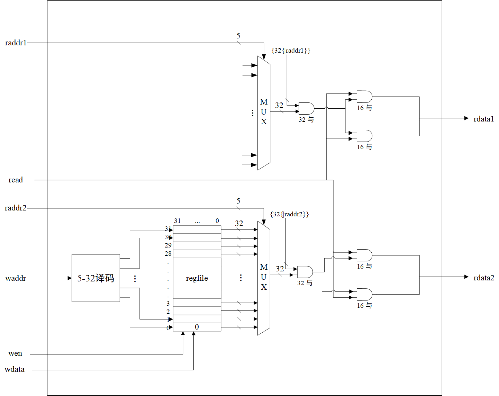
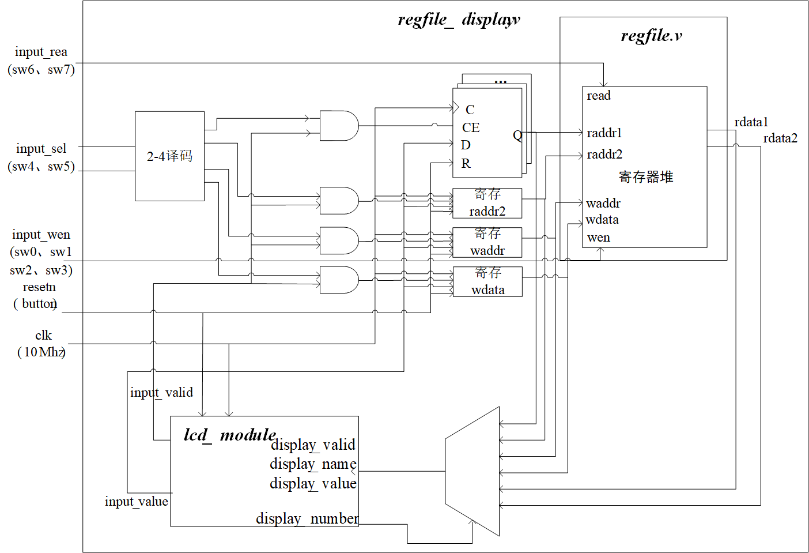
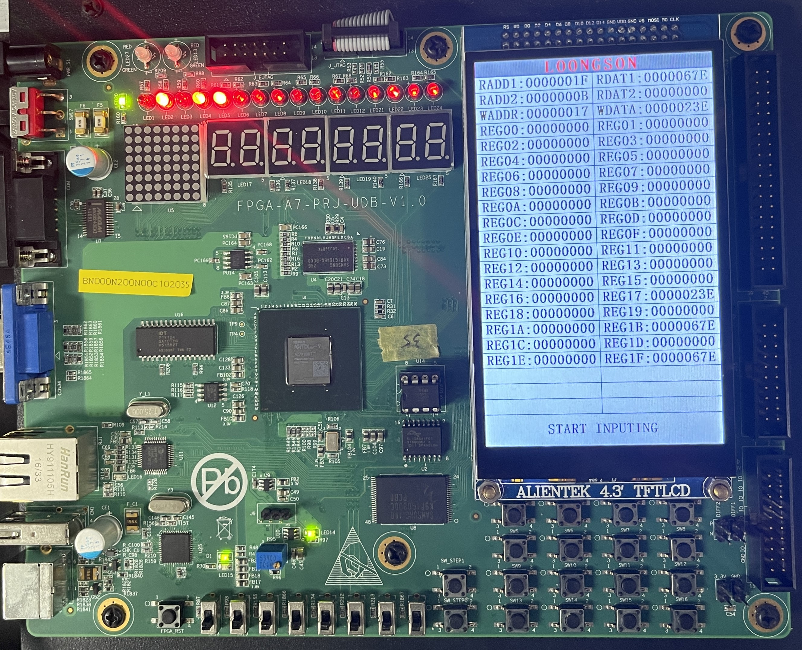
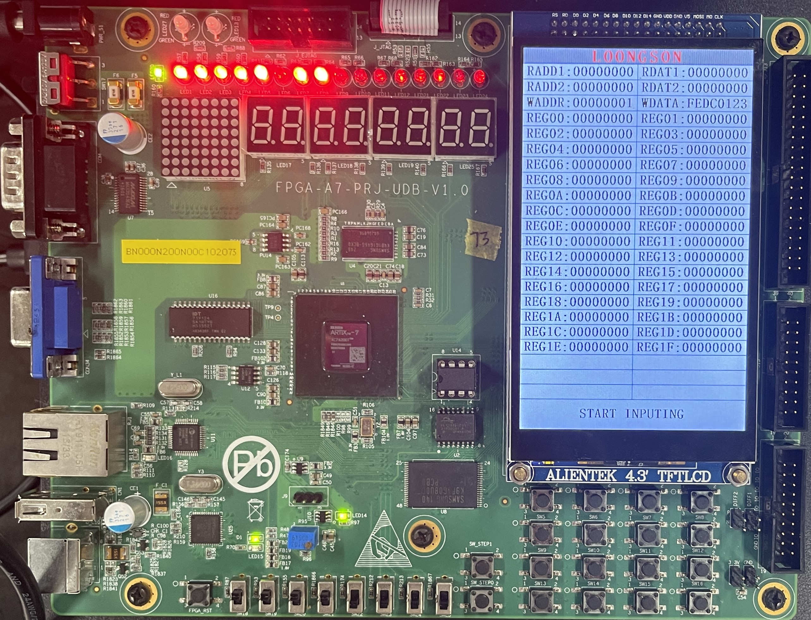
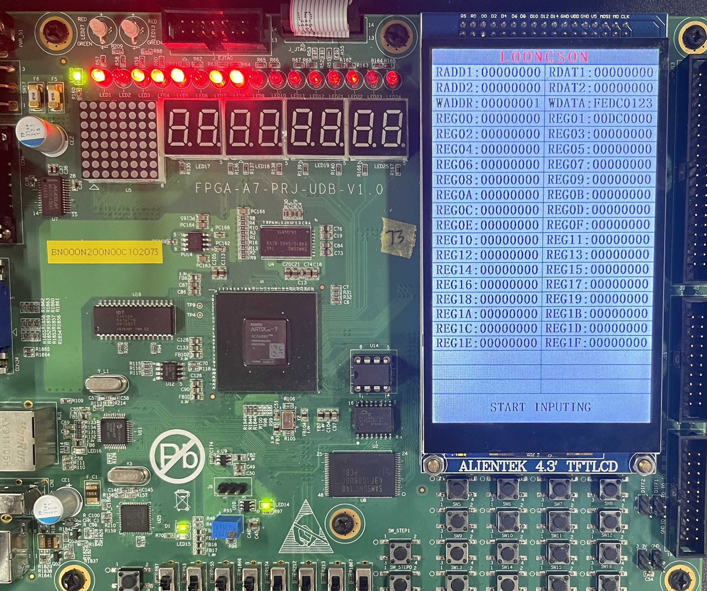
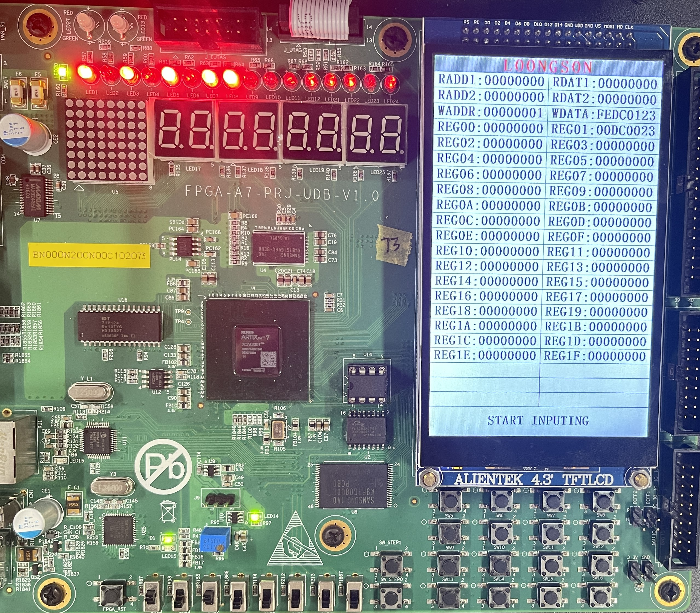
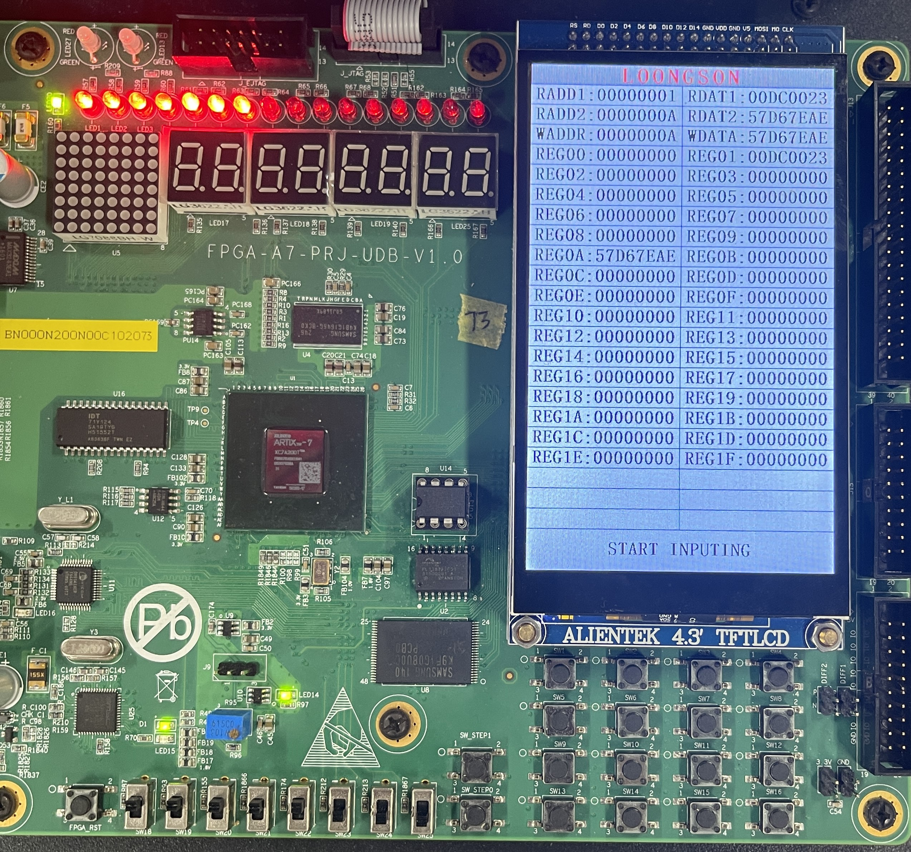
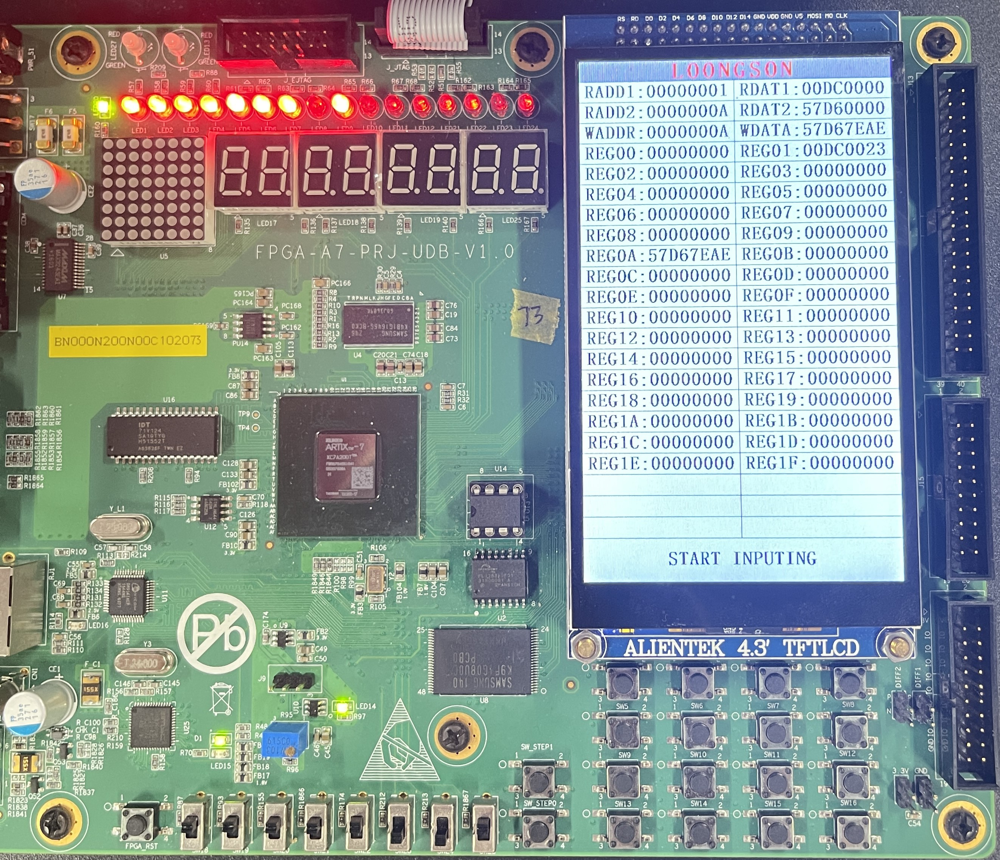
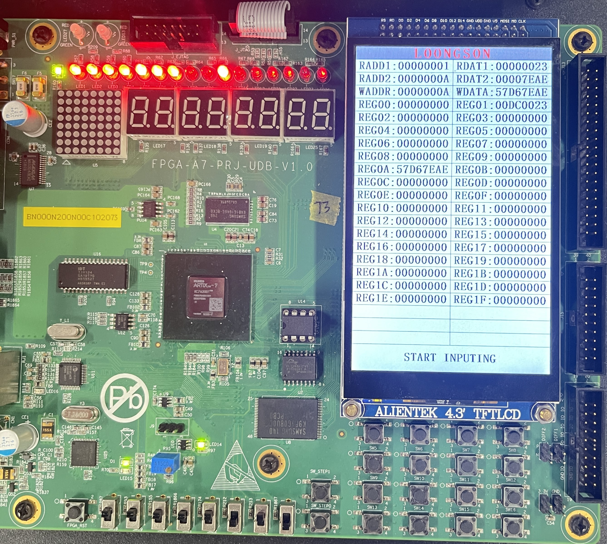
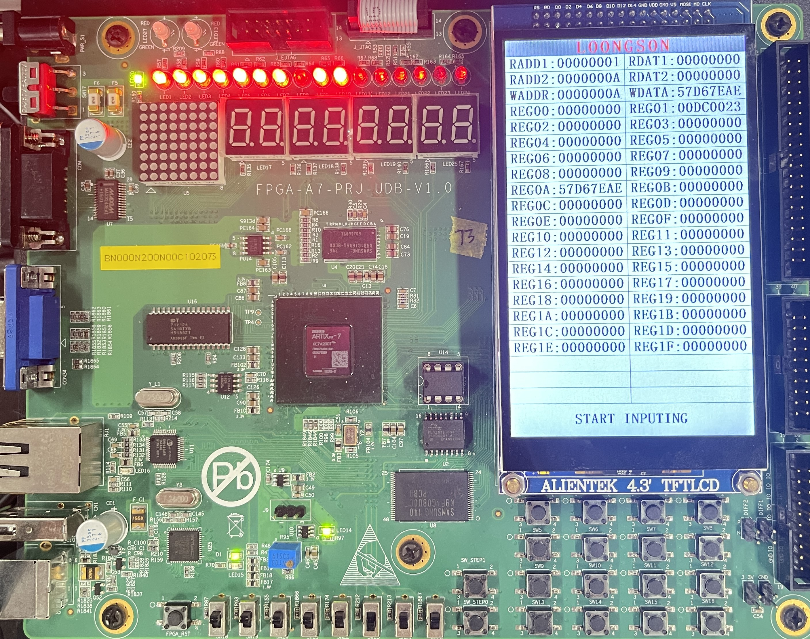

# <center>**组成原理课程第3次实验报告**</center>

## <center>**实验名称：**寄存器堆实现&emsp;班级：李涛老师</center>
### <center>**学生姓名：刘修铭&emsp;&emsp;学号：2112492&emsp;&emsp;指导老师：董前琨**</center>
### <center>**实验地点：A306&emsp;&emsp;实验时间：2023.4.18&emsp;&emsp;**</center>


##  一、实验目的

1. 熟悉并掌握 MIPS 计算机中寄存器堆的原理和设计方法。 
2. 初步了解 MIPS 指令结构和源操作数/目的操作数的概念。 
3. 熟悉并运用 verilog 语言进行电路设计。 
4. 为后续设计 cpu 的实验打下基础。 


## 二、 实验内容说明

* 复现寄存器堆实验；
* 修改原有的原理图和模块图；
* 针对写操作：
  * 原来是一次写入4个字节32位数，现把wen拓宽，每位控制写入一个字节（8位）
    * 0011: 写低16位，后2个字节
    * 0001: 写低8位，后1个字节
    * 1100: 写高16位，前2个字节
* 针对读操作：
  * 添加一个开关，控制读取两个字节数据（高16位或者低16位）
    * 01: 读低16位
    * 10: 读高16位
    * 11: 读完整的32位
* 上箱验证。


## 三、实验原理图

* 实验原理图

  
  
* 顶层模块图

  


## 四、实验步骤

### **（一）复现寄存器堆实验**
此处按照实验指导手册操作即可，重复简单的复制粘贴工作，不再赘述。

### **（二）改进寄存器堆实验**
1. ##### 修改 regfile.v 文件
* 将`wen`改为4位，分别对应控制写入32位寄存器4个不同字节的每个字节
  * 0011: 写后2个字节
  * 0001: 写后1个字节
  * 1100: 写前2个字节
* 添加一个2位的`read`开关，控制读取两个字节数据（高16位或者低16位）
  * 01: 读低16位
  * 10: 读高16位
  * 11: 读完整的32位
```verilog
module regfile(
    input             clk,
    input      [3 :0] wen,
    input      [4 :0] raddr1,
    input      [4 :0] raddr2,
    input      [4 :0] waddr,
    input      [31:0] wdata,
    input      [1: 0] read,
    output reg [31:0] rdata1,
    output reg [31:0] rdata2,
    input      [4 :0] test_addr,
    output reg [31:0] test_data
    );
    reg [31:0] rf[31:0];
```
* 修改赋值语句，按照上述描述将`wdata`中的相应位的数存入`wadder`
  * 当`wen[i]`为1时，对应字节的数存入寄存器

```verilog
    always @(posedge clk)
    begin
        if (wen[0]) 
        begin
            rf[waddr][7:0] <= wdata[7:0];
        end
    end
    always @(posedge clk)
    begin
        if (wen[1]) 
        begin
            rf[waddr][15:8] <= wdata[15:8];
        end
    end
    always @(posedge clk)
    begin
        if (wen[2]) 
        begin
            rf[waddr][23:16] <= wdata[23:16];
        end
    end
    always @(posedge clk)
    begin
        if (wen[3]) 
        begin
            rf[waddr][31:24] <= wdata[31:24];
        end
    end
```
* 修改端口的读数规则，利用与门实现两位的`read`对读数的控制
  * 当`read[i]`为1时，读取相应位数的数值显示到lcd屏幕
```verilog
    //读端口1
    always @(*)
    begin
        case (raddr1)
            5'd1 : rdata1 <= {rf[1 ][31:16] & {16{read[1]}},rf[1 ][15:0] & {16{read[0]}}};
            5'd2 : rdata1 <= {rf[2 ][31:16] & {16{read[1]}},rf[2 ][15:0] & {16{read[0]}}};
            5'd3 : rdata1 <= {rf[3 ][31:16] & {16{read[1]}},rf[3 ][15:0] & {16{read[0]}}};
            5'd4 : rdata1 <= {rf[4 ][31:16] & {16{read[1]}},rf[4 ][15:0] & {16{read[0]}}};
            5'd5 : rdata1 <= {rf[5 ][31:16] & {16{read[1]}},rf[5 ][15:0] & {16{read[0]}}};
            5'd6 : rdata1 <= {rf[6 ][31:16] & {16{read[1]}},rf[6 ][15:0] & {16{read[0]}}};
            5'd7 : rdata1 <= {rf[7 ][31:16] & {16{read[1]}},rf[7 ][15:0] & {16{read[0]}}};
            5'd8 : rdata1 <= {rf[8 ][31:16] & {16{read[1]}},rf[8 ][15:0] & {16{read[0]}}};
            5'd9 : rdata1 <= {rf[9 ][31:16] & {16{read[1]}},rf[9 ][15:0] & {16{read[0]}}};
            5'd10: rdata1 <= {rf[10][31:16] & {16{read[1]}},rf[10][15:0] & {16{read[0]}}};
            5'd11: rdata1 <= {rf[11][31:16] & {16{read[1]}},rf[11][15:0] & {16{read[0]}}};
            5'd12: rdata1 <= {rf[12][31:16] & {16{read[1]}},rf[12][15:0] & {16{read[0]}}};
            5'd13: rdata1 <= {rf[13][31:16] & {16{read[1]}},rf[13][15:0] & {16{read[0]}}};
            5'd14: rdata1 <= {rf[14][31:16] & {16{read[1]}},rf[14][15:0] & {16{read[0]}}};
            5'd15: rdata1 <= {rf[15][31:16] & {16{read[1]}},rf[15][15:0] & {16{read[0]}}};
            5'd16: rdata1 <= {rf[16][31:16] & {16{read[1]}},rf[16][15:0] & {16{read[0]}}};
            5'd17: rdata1 <= {rf[17][31:16] & {16{read[1]}},rf[17][15:0] & {16{read[0]}}};
            5'd18: rdata1 <= {rf[18][31:16] & {16{read[1]}},rf[18][15:0] & {16{read[0]}}};
            5'd19: rdata1 <= {rf[19][31:16] & {16{read[1]}},rf[19][15:0] & {16{read[0]}}};
            5'd20: rdata1 <= {rf[20][31:16] & {16{read[1]}},rf[20][15:0] & {16{read[0]}}};
            5'd21: rdata1 <= {rf[21][31:16] & {16{read[1]}},rf[21][15:0] & {16{read[0]}}};
            5'd22: rdata1 <= {rf[22][31:16] & {16{read[1]}},rf[22][15:0] & {16{read[0]}}};
            5'd23: rdata1 <= {rf[23][31:16] & {16{read[1]}},rf[23][15:0] & {16{read[0]}}};
            5'd24: rdata1 <= {rf[24][31:16] & {16{read[1]}},rf[24][15:0] & {16{read[0]}}};
            5'd25: rdata1 <= {rf[25][31:16] & {16{read[1]}},rf[25][15:0] & {16{read[0]}}};
            5'd26: rdata1 <= {rf[26][31:16] & {16{read[1]}},rf[26][15:0] & {16{read[0]}}};
            5'd27: rdata1 <= {rf[27][31:16] & {16{read[1]}},rf[27][15:0] & {16{read[0]}}};
            5'd28: rdata1 <= {rf[28][31:16] & {16{read[1]}},rf[28][15:0] & {16{read[0]}}};
            5'd29: rdata1 <= {rf[29][31:16] & {16{read[1]}},rf[29][15:0] & {16{read[0]}}};
            5'd30: rdata1 <= {rf[30][31:16] & {16{read[1]}},rf[30][15:0] & {16{read[0]}}};
            5'd31: rdata1 <= {rf[31][31:16] & {16{read[1]}},rf[31][15:0] & {16{read[0]}}};
            default : rdata1 <= 32'd0;
        endcase
    end
    //读端口2
    always @(*)
    begin
        case (raddr2)
            5'd1 : rdata2 <= {rf[1 ][31:16] & {16{read[1]}},rf[1 ][15:0] & {16{read[0]}}};
            5'd2 : rdata2 <= {rf[2 ][31:16] & {16{read[1]}},rf[2 ][15:0] & {16{read[0]}}};
            5'd3 : rdata2 <= {rf[3 ][31:16] & {16{read[1]}},rf[3 ][15:0] & {16{read[0]}}};
            5'd4 : rdata2 <= {rf[4 ][31:16] & {16{read[1]}},rf[4 ][15:0] & {16{read[0]}}};
            5'd5 : rdata2 <= {rf[5 ][31:16] & {16{read[1]}},rf[5 ][15:0] & {16{read[0]}}};
            5'd6 : rdata2 <= {rf[6 ][31:16] & {16{read[1]}},rf[6 ][15:0] & {16{read[0]}}};
            5'd7 : rdata2 <= {rf[7 ][31:16] & {16{read[1]}},rf[7 ][15:0] & {16{read[0]}}};
            5'd8 : rdata2 <= {rf[8 ][31:16] & {16{read[1]}},rf[8 ][15:0] & {16{read[0]}}};
            5'd9 : rdata2 <= {rf[9 ][31:16] & {16{read[1]}},rf[9 ][15:0] & {16{read[0]}}};
            5'd10: rdata2 <= {rf[10][31:16] & {16{read[1]}},rf[10][15:0] & {16{read[0]}}};
            5'd11: rdata2 <= {rf[11][31:16] & {16{read[1]}},rf[11][15:0] & {16{read[0]}}};
            5'd12: rdata2 <= {rf[12][31:16] & {16{read[1]}},rf[12][15:0] & {16{read[0]}}};
            5'd13: rdata2 <= {rf[13][31:16] & {16{read[1]}},rf[13][15:0] & {16{read[0]}}};
            5'd14: rdata2 <= {rf[14][31:16] & {16{read[1]}},rf[14][15:0] & {16{read[0]}}};
            5'd15: rdata2 <= {rf[15][31:16] & {16{read[1]}},rf[15][15:0] & {16{read[0]}}};
            5'd16: rdata2 <= {rf[16][31:16] & {16{read[1]}},rf[16][15:0] & {16{read[0]}}};
            5'd17: rdata2 <= {rf[17][31:16] & {16{read[1]}},rf[17][15:0] & {16{read[0]}}};
            5'd18: rdata2 <= {rf[18][31:16] & {16{read[1]}},rf[18][15:0] & {16{read[0]}}};
            5'd19: rdata2 <= {rf[19][31:16] & {16{read[1]}},rf[19][15:0] & {16{read[0]}}};
            5'd20: rdata2 <= {rf[20][31:16] & {16{read[1]}},rf[20][15:0] & {16{read[0]}}};
            5'd21: rdata2 <= {rf[21][31:16] & {16{read[1]}},rf[21][15:0] & {16{read[0]}}};
            5'd22: rdata2 <= {rf[22][31:16] & {16{read[1]}},rf[22][15:0] & {16{read[0]}}};
            5'd23: rdata2 <= {rf[23][31:16] & {16{read[1]}},rf[23][15:0] & {16{read[0]}}};
            5'd24: rdata2 <= {rf[24][31:16] & {16{read[1]}},rf[24][15:0] & {16{read[0]}}};
            5'd25: rdata2 <= {rf[25][31:16] & {16{read[1]}},rf[25][15:0] & {16{read[0]}}};
            5'd26: rdata2 <= {rf[26][31:16] & {16{read[1]}},rf[26][15:0] & {16{read[0]}}};
            5'd27: rdata2 <= {rf[27][31:16] & {16{read[1]}},rf[27][15:0] & {16{read[0]}}};
            5'd28: rdata2 <= {rf[28][31:16] & {16{read[1]}},rf[28][15:0] & {16{read[0]}}};
            5'd29: rdata2 <= {rf[29][31:16] & {16{read[1]}},rf[29][15:0] & {16{read[0]}}};
            5'd30: rdata2 <= {rf[30][31:16] & {16{read[1]}},rf[30][15:0] & {16{read[0]}}};
            5'd31: rdata2 <= {rf[31][31:16] & {16{read[1]}},rf[31][15:0] & {16{read[0]}}};
            default : rdata2 <= 32'd0;
        endcase
    end
````
2. ##### 修改 regfile_display.v 文件
* 添加`wen`、`read`输入按钮以及多个LED显示指示灯
```verilog
module regfile_display(
    //时钟与复位信号
    input clk,
    input resetn,    //后缀"n"代表低电平有效

    //拨码开关，用于产生写使能和选择输入数
    input [3:0] wen,
    input [1:0] input_sel,
    input [1:0] read,

    //led灯，用于指示写使能信号，正在输入什么数据，读数据的位数
    output led_wen1,
    output led_wen2,
    output led_wen3,
    output led_wen4,
    output led_waddr,    //指示输入写地址
    output led_wdata,    //指示输入写数据
    output led_raddr1,   //指示输入读地址1
    output led_raddr2,   //指示输入读地址2
    output led_read1,
    output led_read2,

    //触摸屏相关接口，不需要更改
    output lcd_rst,
    output lcd_cs,
    output lcd_rs,
    output lcd_wr,
    output lcd_rd,
    inout[15:0] lcd_data_io,
    output lcd_bl_ctr,
    inout ct_int,
    inout ct_sda,
    output ct_scl,
    output ct_rstn
);
```
* 添加LED显示语句
```verilog
//-----{LED显示}begin
    assign led_wen1    = wen[3];
    assign led_wen2    = wen[2];
    assign led_wen3    = wen[1];
    assign led_wen4    = wen[0];
    assign led_raddr1 = (input_sel==2'd0);
    assign led_raddr2 = (input_sel==2'd1);
    assign led_waddr  = (input_sel==2'd2);
    assign led_wdata  = (input_sel==2'd3);
    assign led_read1  = read[0];
    assign led_read2  = read[1];
//-----{LED显示}end
```
* 按照`regfile.v`文件中的`moudle`定义修改调用参数
```verilog
//-----{调用寄存器堆模块}begin
    //寄存器堆多增加一个读端口，用于在触摸屏上显示32个寄存器值
    wire [31:0] test_data;  
    wire [4 :0] test_addr;

    reg  [4 :0] raddr1;
    reg  [4 :0] raddr2;
    reg  [4 :0] waddr;
    reg  [31:0] wdata;
    wire [31:0] rdata1;
    wire [31:0] rdata2;
    regfile rf_module(
        .clk   (clk   ),
        .wen   (wen   ),
        .raddr1(raddr1),
        .raddr2(raddr2),
        .waddr (waddr ),
        .wdata (wdata ),
        .read (read ),
        .rdata1(rdata1),
        .rdata2(rdata2),
        .test_addr(test_addr),
        .test_data(test_data)
    );
//-----{调用寄存器堆模块}end
```
3. ##### 修改 regfile.xdc 文件
* 添加LED灯连接的约束语句
```verilog
#led灯连接，用于输出
set_property PACKAGE_PIN H7 [get_ports led_wen1]
set_property PACKAGE_PIN D5 [get_ports led_wen2]
set_property PACKAGE_PIN A3 [get_ports led_wen3]
set_property PACKAGE_PIN A5 [get_ports led_wen4]
set_property PACKAGE_PIN A4 [get_ports led_waddr]
set_property PACKAGE_PIN F7 [get_ports led_wdata]
set_property PACKAGE_PIN G8 [get_ports led_raddr1]
set_property PACKAGE_PIN H8 [get_ports led_raddr2]
set_property PACKAGE_PIN J8 [get_ports led_read1]
set_property PACKAGE_PIN J23 [get_ports led_read2]
```
* 添加拨码开关连接的约束语句
```verilog
#拨码开关连接，用于输入，依次为sw0~sw7
set_property PACKAGE_PIN AC21 [get_ports wen[3]]
set_property PACKAGE_PIN AD24 [get_ports wen[2]]
set_property PACKAGE_PIN AC22 [get_ports wen[1]]
set_property PACKAGE_PIN AC23 [get_ports wen[0]]
set_property PACKAGE_PIN AB6  [get_ports input_sel[1]]
set_property PACKAGE_PIN W6   [get_ports input_sel[0]]
set_property PACKAGE_PIN AA7  [get_ports read[1]]
set_property PACKAGE_PIN Y6   [get_ports read[0]]

set_property IOSTANDARD LVCMOS33 [get_ports clk]
set_property IOSTANDARD LVCMOS33 [get_ports resetn]
set_property IOSTANDARD LVCMOS33 [get_ports led_wen1]
set_property IOSTANDARD LVCMOS33 [get_ports led_wen2]
set_property IOSTANDARD LVCMOS33 [get_ports led_wen3]
set_property IOSTANDARD LVCMOS33 [get_ports led_wen4]
set_property IOSTANDARD LVCMOS33 [get_ports led_raddr1]
set_property IOSTANDARD LVCMOS33 [get_ports led_raddr2]
set_property IOSTANDARD LVCMOS33 [get_ports led_waddr]
set_property IOSTANDARD LVCMOS33 [get_ports led_wdata]
set_property IOSTANDARD LVCMOS33 [get_ports led_read1]
set_property IOSTANDARD LVCMOS33 [get_ports led_read2]
set_property IOSTANDARD LVCMOS33 [get_ports wen[3]]
set_property IOSTANDARD LVCMOS33 [get_ports wen[2]]
set_property IOSTANDARD LVCMOS33 [get_ports wen[1]]
set_property IOSTANDARD LVCMOS33 [get_ports wen[0]]
set_property IOSTANDARD LVCMOS33 [get_ports input_sel[1]]
set_property IOSTANDARD LVCMOS33 [get_ports input_sel[0]]
set_property IOSTANDARD LVCMOS33 [get_ports read[1]]
set_property IOSTANDARD LVCMOS33 [get_ports read[0]]
```
### **（三）上实验箱验证**
运行相关检查并上箱验证。


## 五、实验结果分析——上实验箱验证
### **（一）复现**



#### 解释：

* 拨码开关（左起）
  * 1：写使能 wen ，置1将数据写入寄存器
  * 2-3：两位input_sel，用于控制正在输入什么数据
    * 11：输入`radd1`
    * 10：输入`radd2`
    * 01：输入`waddr`
    * 00：输入`wdata`
* LED灯（左起）
  * 1：wen
  * 2：raddr1
  * 3：raddr2
  * 4：waddr
  * 5：wdata
### **（二）改进**
1. ##### 初始化
    
2. ##### 通过修改`wen`控制写入位数
* wen=0100
 
 由上述照片可知，`REG01`的第三字节被写入数据，功能得到验证

* wen=0101
 
 由上述照片可知，`REG01`的第一和第三字节被写入数据，功能得到验证

3. ##### 通过修改`read`控制读取位数
* read=11
 
  由上述照片可知，`RADD`指向的寄存器的32位数据均被读取，功能得到验证
* read=10
 
  由上述照片可知，`RADD`指向的寄存器的32位数据的高16位被读取，功能得到验证
* read=01
 
  由上述照片可知，`RADD`指向的寄存器的32位数据的低16位被读取，功能得到验证
* read=00
 
  由上述照片可知，`RADD`指向的寄存器的32位数据均未被读取，功能得到验证


## 六、总结感想
* 对于visio的使用进一步熟练；
* 本次实验难度较高，对所给代码的各个部分须认真阅读并加以理解方可完成本次实验；
* 通过本次实验，更加理解了整个程序的流程以及实验箱的结构，进一步熟悉了verilog代码的编写；
* 为今后的实验打好了基础。


