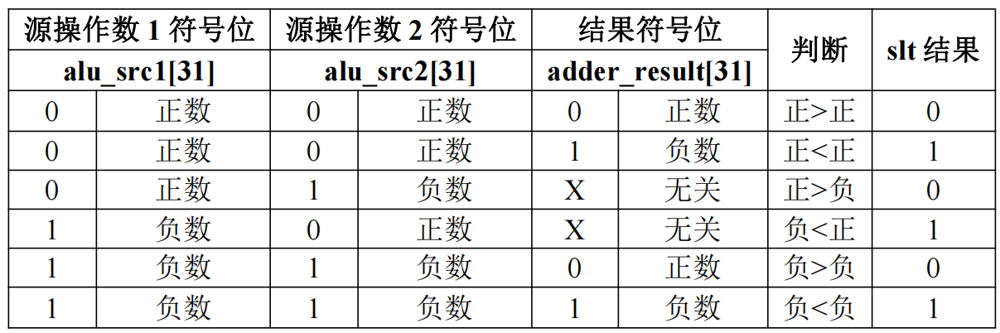

# <center>**组成原理课程第4次实验报告**</center>

## <center>**实验名称：**ALU模块实现&emsp;班级：李涛老师</center>

### <center>**学生姓名：刘修铭&emsp;&emsp;学号：2112492&emsp;&emsp;指导老师：董前琨**</center>

### <center>**实验地点：A306&emsp;&emsp;实验时间：2023.4.26&emsp;&emsp;**</center>


##  一、实验目的

1. 熟悉 MIPS 指令集中的运算指令，学会对这些指令进行归纳分类。 
2. 了解 MIPS 指令结构。 

3. 熟悉并掌握 ALU 的原理、功能和设计。 

4. 进一步加强运用 verilog 语言进行电路设计的能力。 

5. 为后续设计 cpu 的实验打下基础。


## 二、 实验内容说明

* 复现ALU模块实现实验；
* 完成对ALU运算器的改进，要求：
  * 压缩ALU运算器的控制信号位宽`alu_control`
    * 调整到4位

  * 扩展ALU运算器的运算数量
    * 补充三个：
      * 有符号数比较，大于置位
      * 按位同或
      * 低位加载（op2的低16位放在结果的低16位）
* 上箱验证。


## 三、实验原理图


## 四、实验原理

### 控制关系

​		由于我们要将控制信号缩减为4位，用以表示15种运算，因此需要重新设计控制信号及其ALU操作。改后的ALU控制关系及对应操作如下表（新增了三种操作：大于置位、算术左移、低位加载）：

| CONTR |       ALU操作        |
| :---: | :------------------: |
|   0   |          无          |
|   1   |         加法         |
|   2   |         减法         |
|   3   | 有符号比较，小于置位 |
|   4   | 无符号比较，小于置位 |
|   5   |        按位与        |
|   6   |       按位或非       |
|   7   |        按位或        |
|   8   |       按位异或       |
|   9   |       逻辑左移       |
|   A   |       逻辑右移       |
|   B   |       算数右移       |
|   C   |       高位加载       |
|   D   | 有符号比较，大于置位 |
|   E   |       按位同或       |
|   F   |       低位加载       |

### 实现原理

* #### 原12个操作

  * 加减法
    * 调用实验一中adder加法器实现。
  * 有符号比较，小于置位
    * 
    * 有符号 32 位比较小于置位运算结果表达式：slt_result = (alu_src1[31] & ~alu_src2[31]) | (~(alu_src1[31]^alu_src2[31]) & adder_result[31])
  * 无符号比较，小于置位
    * 对于 32 位无符号比较的小于置位，可在其高位前填 0 组合为 33 位正数的比较， 即{1’b0, src1}和{1’b0, src2}的比较，最高位符号位为 0。对比上图可知，对于正数的比较，只要减法结果的符号位为 1，则表示小于。而 33 位正数相减，其结果的符号位最终可由 32 位加法的 cout+1’b1 得到。故无符号 32 位比较小于置位运算结果表达式为：sltu_result = ~adder_cout
  * 按位与、按位或非、按位或、按位异或
    * 借助`verilog`语言运算函数`&`、`\`和`^`实现。
  * 逻辑左移、逻辑右移、算数右移
    * 移位分三步进行：
      * 第一步根据移位量低2位，即 [1:0] 位，做第一次移位；
      * 第二步在第一次移位基础上根据移位量 [3:2] 位做第二次移位；
      * 第三步在第二次移位基础上根据移位量[4]位做第三次移位。
  * 高位加载
    * 专门用于设置寄存器中常数的高16位置。将op2低16位存放到寄存器的高16位，结果的低16位用0填充。

* #### 新增3个操作

  * 有符号比较，大于置位
    * 相比于有符号比较的小于置位，在改为大于置位的时候，需要考虑等于的情况，因此我们增设一个`adder_zero`值，用于排除相等的情况。其对应真值表如下图。
    * 
    * 其中，`adder_zero`是对结果` adder_result`进行或缩位运算，当源操作数1=源操作数2时，`adder_zero`为0，不置位。因此，大于置位的实现是：~（小于置位表达式）& adder_zero，即不满足小于置位且两操作数不相等的就是大于置位。
  * 按位同或
    * 按位异或取反即可。
  * 低位加载
    * 将低16位存放到寄存器的低16位，结果的高16位用0填充。


## 五、实验步骤

### **（一）复现ALU模块实现实验**

此处按照实验指导手册操作。将`SRC_1`设置为10101010，`SRC_2`设置为02020202，通过改变`CONTR`的值来选定ALU操作，并将`RESUL`的输出值做记录，用于后面验证。


### **（二）改进ALU运算器实验**

1. ##### 修改 alu.v 文件
* 修改`alu_control`控制信号，改为4位位宽。
```verilog
input  [3:0] alu_control,  // ALU控制信号
```
* 修改独热码
  * 添加三个新增的控制信号
    * `alu_sgt`（有符号比较，大于置位）
    * `alu_nxor`（按位同或）
    * `alu_hui`（低位加载）
    * ```verilog
         wire alu_sla;   //算术左移
         wire alu_nxor;  //按位同或
         wire alu_hui;   //低位加载
         ```
   * 将其改为4位二进制编码
   * ```verilog
     assign alu_add  = (~alu_control[3])&(~alu_control[2])&(~alu_control[1])&(alu_control[0]);//0001
     assign alu_sub  = (~alu_control[3])&(~alu_control[2])&(alu_control[1])&(~alu_control[0]);//0010
     assign alu_slt  = (~alu_control[3])&(~alu_control[2])&(alu_control[1])&(alu_control[0]); //0011
     assign alu_sltu = (~alu_control[3])&(alu_control[2])&(~alu_control[1])&(~alu_control[0]);//0100
     assign alu_and  = (~alu_control[3])&(alu_control[2])&(~alu_control[1])&(alu_control[0]); //0101
     assign alu_nor  = (~alu_control[3])&(alu_control[2])&(alu_control[1])&(~alu_control[0]); //0110
     assign alu_or   = (~alu_control[3])&(alu_control[2])&(alu_control[1])&(alu_control[0]);  //0111
     assign alu_xor  = (alu_control[3])&(~alu_control[2])&(~alu_control[1])&(~alu_control[0]);//1000
     assign alu_sll  = (alu_control[3])&(~alu_control[2])&(~alu_control[1])&(alu_control[0]); //1001
     assign alu_srl  = (alu_control[3])&(~alu_control[2])&(alu_control[1])&(~alu_control[0]); //1010
     assign alu_sra  = (alu_control[3])&(~alu_control[2])&(alu_control[1])&(alu_control[0]);  //1011
     assign alu_lui  = (alu_control[3])&(alu_control[2])&(~alu_control[1])&(~alu_control[0]); //1100
     //补充—————————————————————————————————————————————
     assign alu_sgt  = (alu_control[3])&(alu_control[2])&(~alu_control[1])&(alu_control[0]);  //1101
     assign alu_nxor  = (alu_control[3])&(alu_control[2])&(alu_control[1])&(~alu_control[0]); //1110
     assign alu_hui  = (alu_control[3])&(alu_control[2])&(alu_control[1])&(alu_control[0]);   //1111
     ```

* 编写有符号比较，大于置位，即`sgt`模块
```verilog
wire adder_zero;
assign adder_zero=|adder_result; 
assign sgt_result[31:1] = 31'd0;
assign sgt_result[0] = ~((alu_src1[31] & ~alu_src2[31]) | (~(alu_src1[31]^alu_src2[31]) & adder_result[31])) & adder_zero;
```
* 编写按位同或，即`nxor`模块
```verilog
assign nxor_result = ~xor_result;             // 同或结果为异或取反
````
* 编写低位加载，即`hui`模块
```verilog
assign hui_result = { 16'd0,alu_src2[15:0]};
```
* 将`sgt_result`、`nxor_result`、`hui_result`输出到`alu_sgt`、`alu_nxor`、`alu_hui`中
```verilog
assign alu_result = (alu_add|alu_sub) ? add_sub_result[31:0] : 
                    alu_slt           ? slt_result  :
                    alu_sltu          ? sltu_result :
                    alu_and           ? and_result  :
                    alu_nor           ? nor_result  :
                    alu_or            ? or_result   :
                    alu_xor           ? xor_result  :
                    alu_sll           ? sll_result  :
                    alu_srl           ? srl_result  :
                    alu_sra           ? sra_result  :
                    alu_lui           ? lui_result  :
                    alu_sgt           ? sgt_result  ://有符号数比较，大于置位
                    alu_nxor          ? nxor_result ://按位同或
                    alu_hui           ? hui_result  ://低位加载
                    32'd0;
```
2. ##### 修改 alu_display.v 文件
* 修改`alu_control`的位宽
```verilog
reg   [3:0] alu_control;  // ALU控制信号
```
* 修改`alu_control`的写入
```verilog
//当input_sel为00时，表示输入数控制信号，即alu_control
always @(posedge clk)
begin
    if (!resetn)
    begin
        alu_control <= 12'd0;
    end
    else if (input_valid && input_sel==2'b00)
    begin
        alu_control <= input_value[3:0];
    end
end
```

### **（三）上实验箱验证**
运行相关检查并上箱验证。

## 六、实验结果分析——上实验箱验证

### **（一）复现**

选定`SRC_1`=10101010,`SRC_2`=02020202按照**五、实验步骤（一）**进行操作后得到如下数据
|  SRC_1   |  SRC_2   | CONTR |       ALU操作        |  RESUL   |
| :------: | :------: | :---: | :------------------: | :------: |
| 10101010 | 02020202 |  000  |          无          | 00000000 |
| 10101010 | 02020202 |  800  |         加法         | 12121212 |
| 10101010 | 02020202 |  400  |         减法         | 0E0E0E0E |
| 10101010 | 02020202 |  200  | 有符号比较，小于置位 | 00000000 |
| 10101010 | 02020202 |  100  | 无符号比较，大于置位 | 00000000 |
| 10101010 | 02020202 |  080  |        按位与        | 00000000 |
| 10101010 | 02020202 |  040  |       按位或非       | EDEDEDED |
| 10101010 | 02020202 |  020  |        按位或        | 12121212 |
| 10101010 | 02020202 |  010  |       按位异或       | 12121212 |
| 10101010 | 02020202 |  008  |       逻辑左移       | 02020000 |
| 10101010 | 02020202 |  004  |       逻辑右移       | 00000202 |
| 10101010 | 02020202 |  002  |       算术右移       | 00000202 |
| 10101010 | 02020202 |  001  |       高位加载       | 02020000 |
### **（二）改进**
1. #### 原操作正确性验证

   将`SRC_1`=10101010,`SRC_2`=02020202输入实验箱，按照修改后的操作关系真值表验证前十二个操作，结果与**六、实验结果分析（一）**中记录的数据一致，说明改进成功。
|  SRC_1   |  SRC_2   | CONTR |       ALU操作        |  RESUL   |
| :------: | :------: | :---: | :------------------: | :------: |
| 10101010 | 02020202 |   0   |          无          | 00000000 |
| 10101010 | 02020202 |   1   |         加法         | 12121212 |
| 10101010 | 02020202 |   2   |         减法         | 0E0E0E0E |
| 10101010 | 02020202 |   3   | 有符号比较，小于置位 | 00000000 |
| 10101010 | 02020202 |   4   | 无符号比较，大于置位 | 00000000 |
| 10101010 | 02020202 |   5   |        按位与        | 00000000 |
| 10101010 | 02020202 |   6   |       按位或非       | EDEDEDED |
| 10101010 | 02020202 |   7   |        按位或        | 12121212 |
| 10101010 | 02020202 |   8   |       按位异或       | 12121212 |
| 10101010 | 02020202 |   9   |       逻辑左移       | 02020000 |
| 10101010 | 02020202 |   A   |       逻辑右移       | 00000202 |
| 10101010 | 02020202 |   B   |       算术右移       | 00000202 |
| 10101010 | 02020202 |   C   |       高位加载       | 02020000 |

2. #### 新增操作正确性验证

* 有符号数比较，大于置位

  为保证验证充分性，将采取五种数值情况进行验证。

  * `SRC_1`=`SRC_2`

    取`SRC_1`=`SRC_2`=00000000，则`RESUL`=00000000，进行上箱验证。

    

    如图，`RESUL`=00000000，与预测结果一致，说明逻辑正确。

  * `SRC_1`>`SRC_2`>0

    取`SRC_1`=23456789，`SRC_2`=12345678，则`RESUL`=00000001，进行上箱验证。

    

    如图，`RESUL`=00000001，与预测结果一致，说明逻辑正确。

  * 0<`SRC_1`<`SRC_2`

    取`SRC_1`=01234568，`SRC_2`=12345678，则`RESUL`=00000000，进行上箱验证。

    

    如图，`RESUL`=00000000，与预测结果一致，说明逻辑正确。

  * `SRC_1`<0<`SRC_2`

    取`SRC_1`=DCBA9876，`SRC_2`=12345678，则`RESUL`=00000000，进行上箱验证。

    

    如图，`RESUL`=00000000，与预测结果一致，说明逻辑正确。

  * `SRC_1`<`SRC_2`<0
    取`SRC_1`=FFFFFFFF，`SRC_2`=EEEEEEEE，则`RESUL`=00000001，进行上箱验证。

    

    如图，`RESUL`=00000001，与预测结果一致，说明逻辑正确。

|  SRC_1   |  SRC_2   | CONTR |       ALU操作        |  RESUL   |
| :------: | :------: | :---: | :------------------: | :------: |
| 00000000 | 00000000 |   D   | 有符号比较，大于置位 | 00000000 |
| 23456789 | 12345678 |   D   | 有符号比较，大于置位 | 00000001 |
| 01234568 | 12345678 |   D   | 有符号比较，大于置位 | 00000000 |
| DCBA9876 | 12345678 |   D   | 有符号比较，大于置位 | 00000000 |
| FFFFFFFF | EEEEEEEE |   D   | 有符号比较，大于置位 | 00000001 |

* 按位同或

  `SRC_1`=10101010，`SRC_2`=02020202时，将其转换为二进制数，按位同或后，转换成十六进制数，可以得到`RESUL`=EDEDEDED，进行上箱验证。
  
  
  
  如图，`RESUL`与预测结果一致，说明逻辑正确。
|  SRC_1   |  SRC_2   | CONTR |       ALU操作        |  RESUL   |
| :------: | :------: | :---: | :------------------: | :------: |
| 10101010 | 02020202 |   E   |          按位同或          | EDEDEDED |
* 低位加载

  `SRC_2`的低16位将被加载到`RESUL`中，当`SRC_2`=02020202时，`RESUL`=00000202，进行上箱验证。
  
  
  
  如图，`SEC_2`的低16位 0202 被加载到结果的低16位，与预测结果相同，说明逻辑正确。

|  SRC_1   |  SRC_2   | CONTR | ALU操作  |  RESUL   |
| :------: | :------: | :---: | :------: | :------: |
| 10101010 | 02020202 |   F   | 低位加载 | 00000202 |


## 七、总结感想

* 本次实验难度较高，对所给代码的各个部分须认真阅读并加以理解方可完成本次实验；
* 本次实验与前面实验联系较为紧密，需认真完成之前实验方可完成本次实验；
* 通过本次实验，更加理解了整个程序的流程以及实验箱的结构，进一步熟悉了verilog代码的编写；

* 通过本次实验，掌握了ALU模块的实现方式，以及不同运算的实现过程；
* 为之后设计CPU打好了基础。


