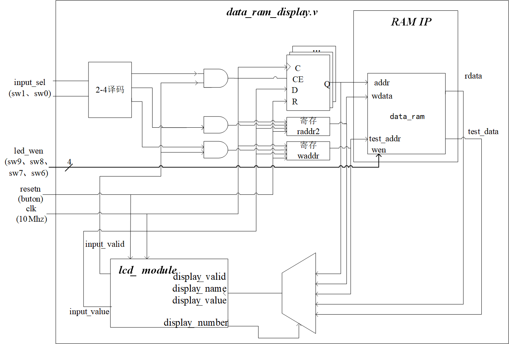
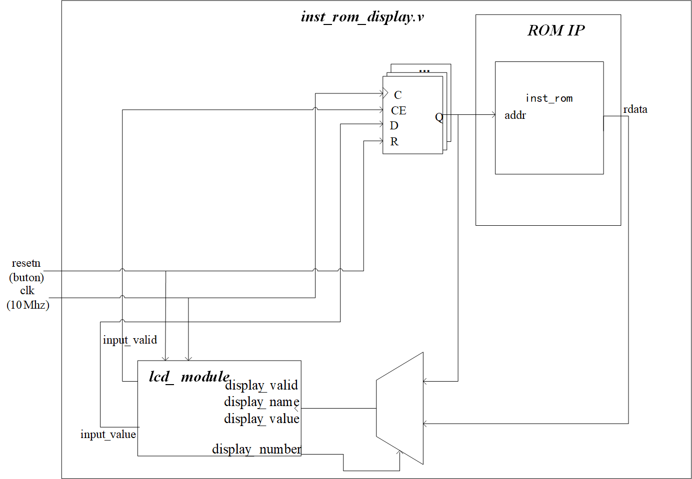
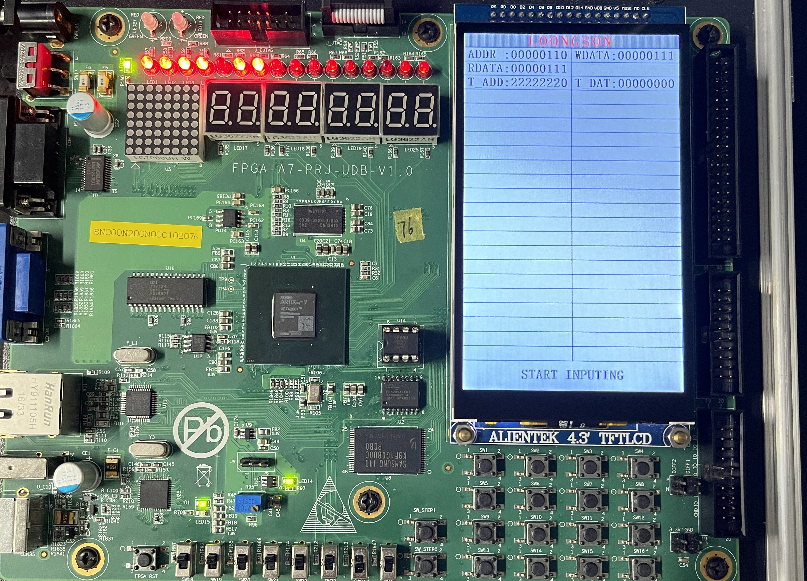
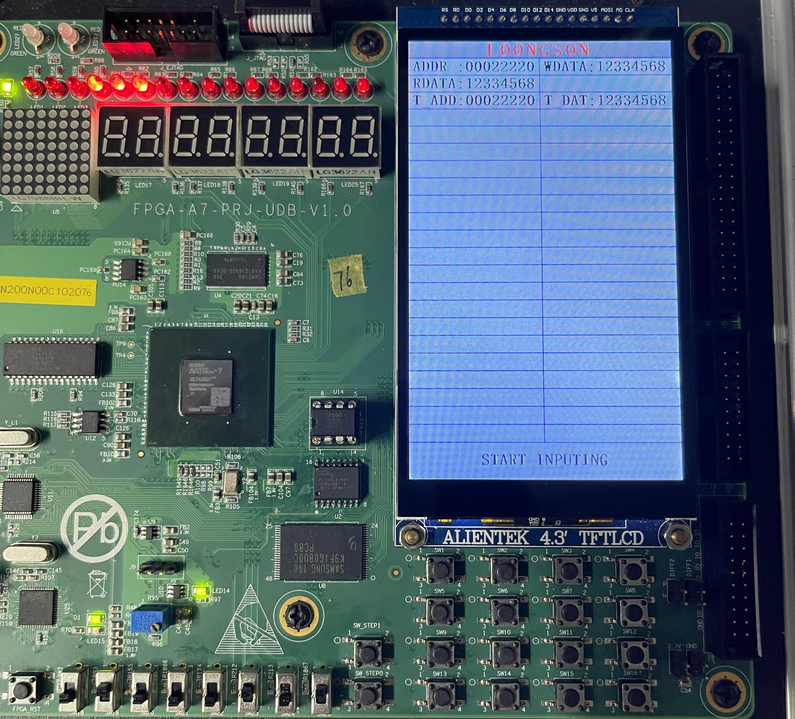
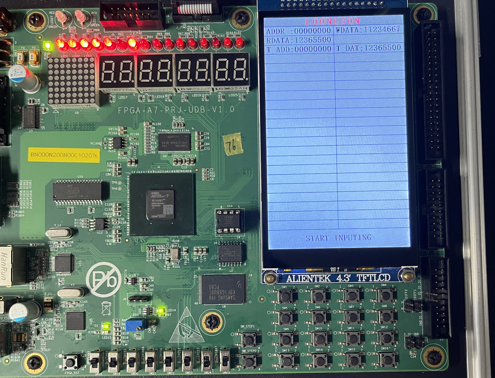
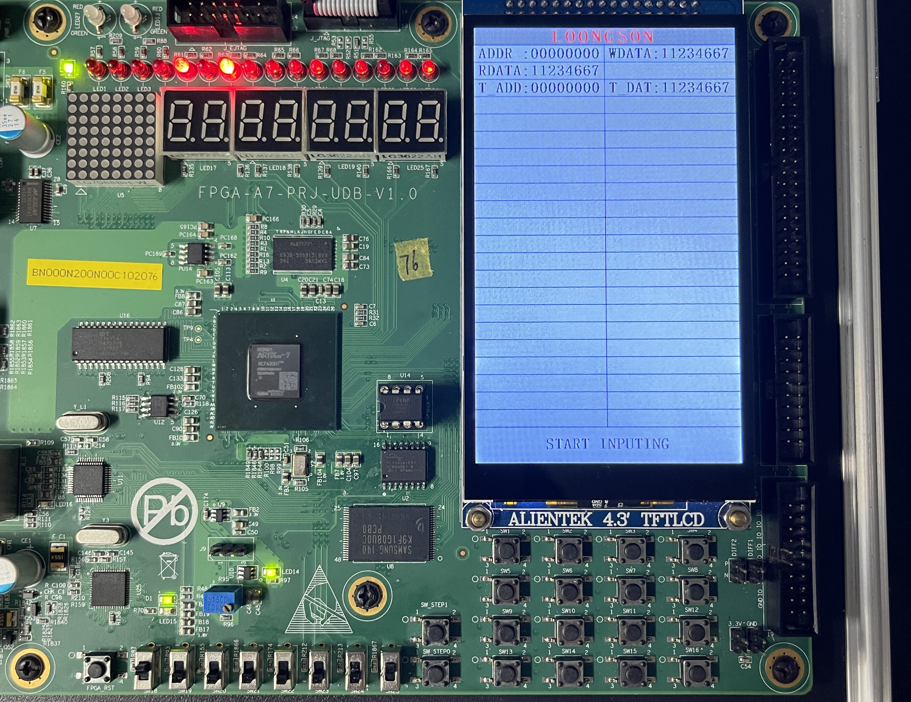
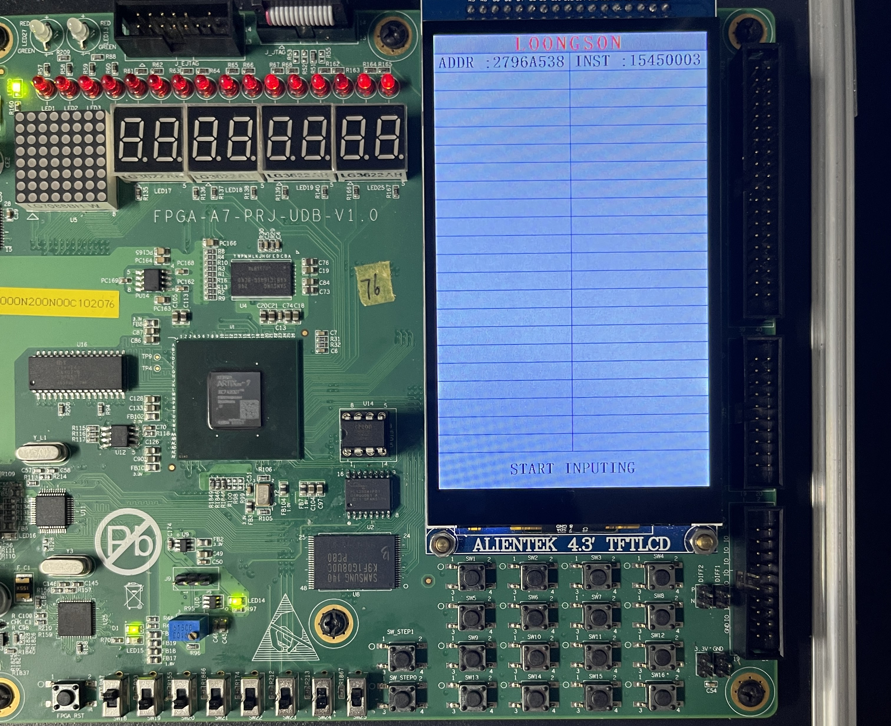
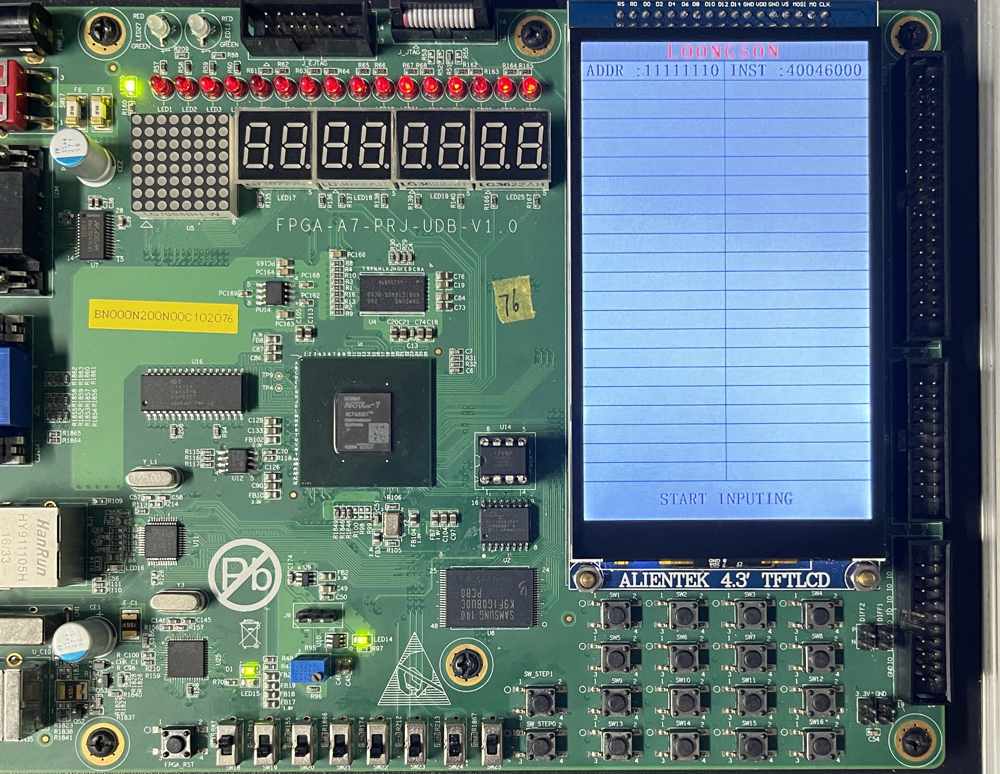

# 
**组成原理课程第5次实验报告**

## 
**实验名称：**存储器实现&emsp;班级：李涛老师

### 
**学生姓名：刘修铭&emsp;&emsp;学号：2112492&emsp;&emsp;指导老师：董前琨**

### 
**实验地点：A306&emsp;&emsp;实验时间：2023.5.16&emsp;&emsp;**

##  一、实验目的

1. 了解只读存储器ROM随机存取存储器RAM的原理。

2. 理解ROM读取数据及RAM读取、写入数据的过程。

3. 理解计算机中存储器地址编址和数据索引方法。

4. 理解同步RAM和异步RAM的区别。

5. 掌握调用xilinx库IP实例化RAM的设计方法。

6. 熟悉并运用verilog语言进行电路设计。

7. 为后续设计cpu的实验打下基础。

   

## 二、 实验内容说明

* 复现存储器实现实验；
* 上箱验证。

## 三、实验原理图

* 同步RAM

  

* 同步ROM

  

## 四、实验步骤

1. 按照实验指导手册，创建相关文件。

2. 上箱验证实验结果

   

## 五、实验结果分析——上实验箱验证

1. ### 异步RAM

   左边两个开关为选择开关，右边四个为置位开关。拨动左边两个开关，选择输入的信息；拨动右边两个开关，将数据写入到对应内存地址中。+

   

   如图所示，设定ADDR=00000110，写入数据WDATA=00000111，可以看到，RDATA=00000111，即RDATA显示的数据为ADDR所示的内存地址存储的数据。

   输入T_ADD=22222220，可以看到，T_DAT=00000000，这是因为我们并没有为地址为T_ADD的存储空间写入值，默认为0，故而T_DAT=00000000。

   

   而对于此图，ADDR=00022220的地址中已经写入WDATA=12334568，可以看到，当T_ADD=00022220时，T_DAT=12334568。

2. ### 同步RAM

   

   如图所示，当ADDR=00000000时，设定WDATA=11234667，但由于拨码开关未拨下，故而数据并未写入，仍然保持之前的数值，可以看到此时RDATA=12365500，T_DAT=12365500。

   

   此时拨动四个拨码开关，数据写入，RDATA与T_DAT一起变为11234667.

3. ### 异步ROM

   

   输入ADDR=11111110，得到对应地址上提前存储好的数据INST=00642823。

4. ### 同步ROM

   

   输入ADDR=1111110，得到对应内存地址上提前存储好的数据INST=40046000。

## 六、总结感想

* 了解了RAM与ROM的区别
  * RAM和ROM都是半导体存储器，区别就在于ROM里面的数据是掉电不丢失的，但是RAM里面的数据是掉电丢失的。
* 了解了同步RAM与异步RAM的区别
  * 访问方式
    * 同步 RAM：同步 RAM 使用时钟信号同步数据的读取和写入操作。访问操作按照时钟信号的边沿进行同步，数据在时钟周期内传输。每个读写操作都需要等待时钟信号的到来，因此同步 RAM 的访问速度受限于时钟频率。
    * 异步 RAM：异步 RAM 不使用时钟信号进行同步，它使用控制信号（如地址和使能信号）来控制数据的读写。访问操作可以在任意时间点进行，不受时钟信号的限制，因此异步 RAM 的访问速度相对较快。

  * 数据传输
    * 同步 RAM：同步 RAM 在数据传输时需要时钟信号进行同步，数据的读取和写入是按照时钟周期进行的，具有固定的数据传输速率。
    * 异步 RAM：异步 RAM 的数据传输是根据控制信号进行的，没有固定的时钟要求，因此数据传输速率可以根据需要进行调整。

  * 控制复杂度
    * 同步 RAM：同步 RAM 的控制电路相对复杂，需要使用时钟信号进行同步，以确保数据的正确读取和写入。
    * 异步 RAM：异步 RAM 的控制电路相对简单，不需要时钟信号进行同步，但需要根据控制信号进行数据传输和控制。
  * 简单来说
    * 同步RAM：发送一个请求，等待返回，然后再发送下一个请求。
    * 异步RAM：发送一个请求，不等待返回，随时可以发送下一个请求。
  * 使用场景
    * 同步RAM：数据存在线程间的共享，或竞态条件。比如多个线程同时对同一个变量进行读和写的操作。
    * 异步RAM：当应用程序在对象上调用了一个需要花费很长时间来执行的方法，并且不希望让程序等待方法的返回。
* 本次实验难度较小，代码部分按照实验手册进行即可，但需要对实验结果进行深度分析；
* 通过本次实验，更加理解了整个程序的流程以及实验箱的结构，进一步熟悉了verilog代码的编写；
* 通过本次实验，掌握了存储器模块的实现方式；
* 为之后设计CPU打好了基础。

 	
