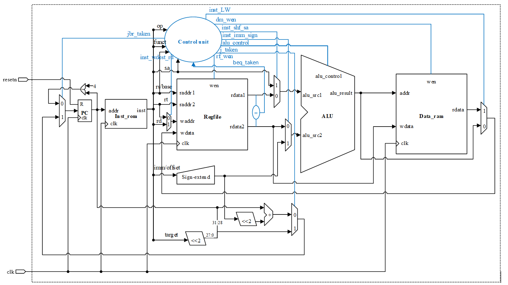
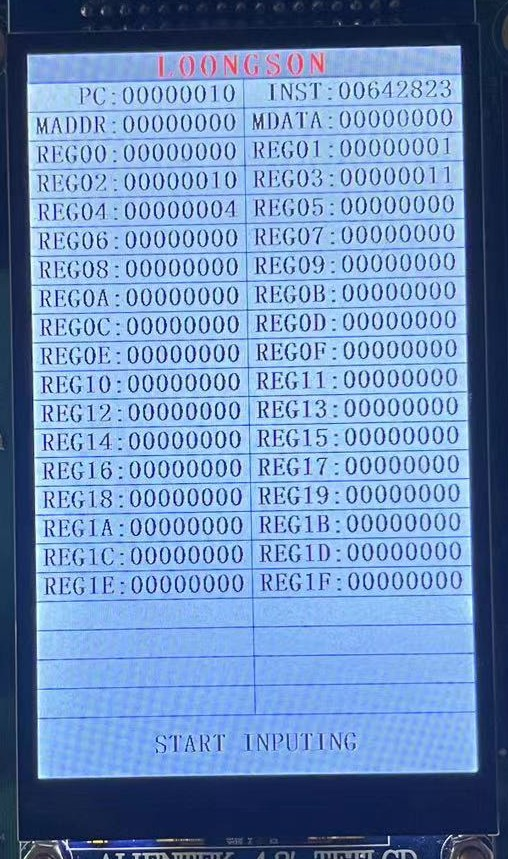
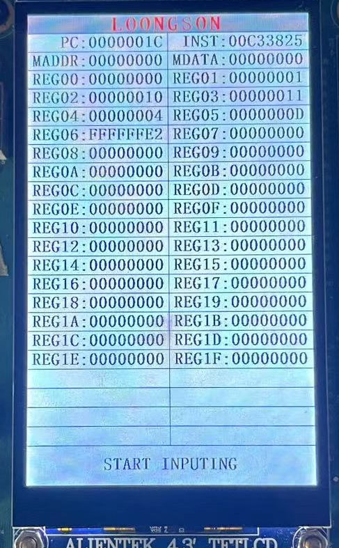
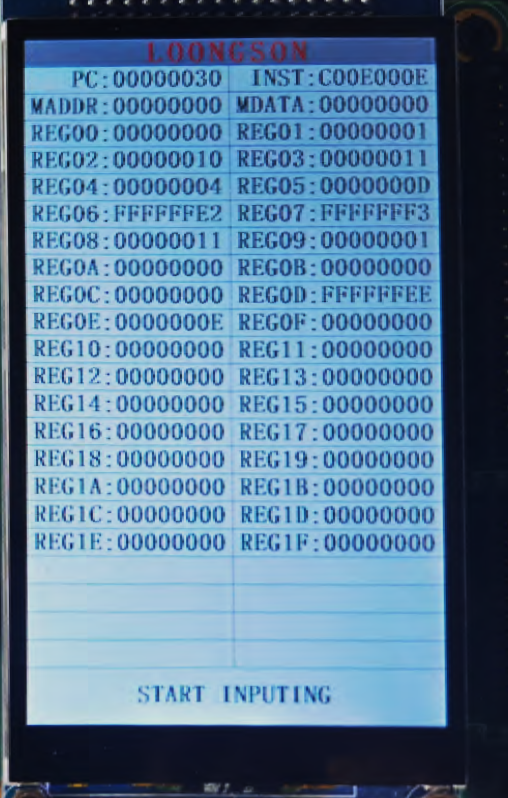
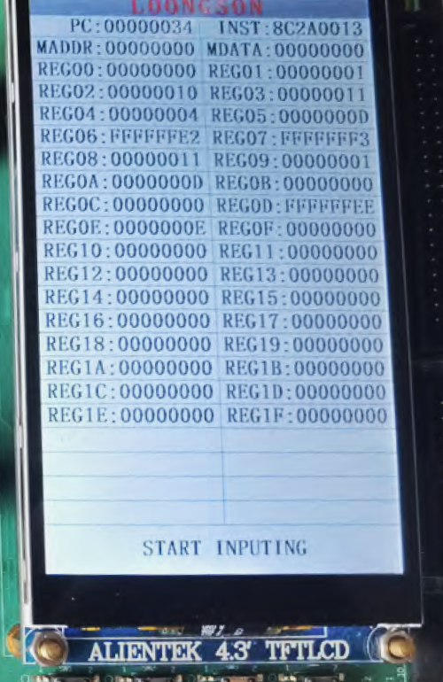

# <center>**组成原理课程第6次实验报告**</center>

## <center>**实验名称：**单周期CPU实现&emsp;班级：李涛老师</center>

### <center>**学生姓名：刘修铭&emsp;&emsp;学号：2112492&emsp;&emsp;指导老师：董前琨**</center>

### <center>**实验地点：A306&emsp;&emsp;实验时间：2023.5.30&emsp;&emsp;**</center>


## 一、实验目的

1. 理解 MIPS 指令结构，理解 MIPS 指令集中常用指令的功能和编码，学会对这些指令进行归纳分类。

2. 了解熟悉 MIPS 体系的处理器结构，如延迟槽，哈佛结构的概念。

3. 熟悉并掌握单周期 CPU 的原理和设计。

4. 进一步加强运用 verilog 语言进行电路设计的能力。

5. 为后续设计多周期 cpu 的实验打下基础。


## 二、 实验内容说明

* 完成单周期CPU实验的复现，并进行实验箱验证。
* 分别添加一种R型指令和I型指令，并进行实验箱验证。


## 三、实验原理图




## 四、单周期CPU的指令执行过程

### 1. 指令

​		单周期CPU能够执行MIPS指令集系统的一个子集，共16条指令，包括存储访问指令、运算指令、跳转指令。根据拥有的字段类型不同，我们将指令分为 **R 型指令**、**I 型指令 **和  **J 型指令**。

* #### R 型指令

|  op  |  rs  |  rt  |  rd  | shamd | funct |
| :--: | :--: | :--: | :--: | :---: | :---: |

op 段（6b）：恒为0b000000；

rs（5b）、rt（5b） ：两个源操作数所在的寄存器号；

rd（5b）：目的操作数所在的寄存器号；

shamt（5位）：位移量，移位指令的移位位数；

func（6b）：决定 R 型指令的具体功能。

* #### I 型指令

|  op  |  rs  |  rt  | constant or address |
| :--: | :--: | :--: | :--: |

op段（6b）：决定 I 型指令类型；

rs（5b）：是第一个源操作数所在的寄存器号；

rt （5b）：是第二个源操作数所在的寄存器号 或 目的操作数所在的寄存器编号。

constant or address（16b）：立即数或地址

* #### J 型指令

|  op  |  address  |
| :--: | :--: |

op段（6b）：决定 J 型指令类型；

constant or address（26b）：转移地址


### 2. 不同指令的执行过程

* #### R 型指令

1. 从指令存储器中取指令，更新 PC 。
2. ALU 根据 funct 字段确定 ALU 的功能。

3. 从寄存器堆中读出寄存器 rs 和 rt。

4. ALU 根据 2 中确定的功能，对从寄存器堆读出的数据进行操作。

5. 将运算结果写入到 rd 字段对应的目标寄存器。

* #### I 型指令

  * 存取指令：

    1. 从指令存储器中取指令，更新 PC 。

    2. ALU 根据 op 字段确定 ALU 的功能。

    3. 从寄存器堆中读出寄存器 rs 的值，并将其与符号扩展后的指令低16位立即数的值相加。

    4. 若为存储指令，则将 rt 寄存器中的值存到上步相加得到的存储器地址；

       若为取数指令，则将 上步所得存储器地址里所存的数据放到 rt 目标寄存器中。

  * 分支指令：
  
    1. 从指令存储器中取指令，更新 PC 。
    2. 从寄存器堆中读出寄存器 rs 和 rt 的值。
    3. 将所读寄存器的两值相减。
    4. 根据上步的结果是否为0，将 PC+4 的值或 address 字段所对应地址存入PC中。


* #### J 型指令

1. 从指令存储器中取指令，更新 PC 。
2. 取出 address 字段，作为目标跳转地址。
3. 将目标跳转地址存入PC中。


## 五、实验步骤

### （一）复现单周期CPU

​		此处按照实验指导手册操作即可，均为复制粘贴工作，无描述意义。

### （二）添加一条R型指令，添加一条I型指令

​		此处选择之前写过的按位同或操作作为添加的R型指令，选择低位加载作为添加的I型指令。下面介绍具体修改之处。

#### 1. 修改 single_cycle_cpu.v 文件

* 将添加的两个操作添加到指令列表中
  * inst_NXOR 表示按位同或操作
  * inst_HUI 表示低位加载操作

```verilog
wire inst_NXOR, inst_HUI;
```

* 将添加的两个操作赋予操作数

```verilog
assign inst_NXOR  = (op == 6'b110001);                  // 逻辑同或运算
assign inst_HUI   = (op == 6'b110000);                  // 立即数装载低半字节
```

* 定义并实现传递到执行模块的 ALU 源操作数和操作码

```verilog
wire inst_nxor, inst_hui;
assign inst_hui = inst_HUI;  // 立即数装载低位
assign inst_nxor = inst_NXOR;// 逻辑同或
```

* 修改立即数拓展指令

```verilog
assign inst_imm_sign = inst_ADDIU | inst_LUI | inst_LW | inst_SW | inst_HUI;
```

* 修改独热编码

```verilog
assign alu_control = {inst_nxor,
                      inst_hui,
                      inst_add,        // ALU操作码，独热编码
                      inst_sub,
                      inst_slt,
                      inst_sltu,
                      inst_and
                      inst_nor,
                      inst_or, 
                      inst_xor,
                      inst_sll,
                      inst_srl,
                      inst_sra,
                      inst_lui};
```

* 修改寄存器的写回值

```verilog
assign inst_wdest_rt = inst_ADDIU | inst_LW   | inst_LUI | inst_HUI;
assign inst_wdest_rd = inst_ADDU  | inst_SUBU | inst_SLT | inst_AND | inst_NOR
                     | inst_OR    | inst_XOR  | inst_SLL | inst_SRL | inst_NXOR;   
```

#### 2. 修改 alu.v 文件

* 拓展 ALU 控制信号

```verilog
input  [13:0] alu_control,  // ALU控制信号
```

* 添加独热码

```verilog
wire alu_nxor;  //按位同或
wire alu_hui;   //低位加载
```

* 添加控制信号

```verilog
assign alu_hui  = alu_control[13];
assign alu_nxor = alu_control[12];
```

* 添加结果信号

```verilog
wire [31:0] hui_result;
wire [31:0] nxor_result;
```

* 添加运算逻辑

```verilog
assign hui_result = {16'd0, alu_src2[15:0]};  // 立即数装载结果为立即数移位至低半字节
assign nxor_result= ~xor_result;              // 同或结果为异或结果按位取反  
```

* 添加选择结果输出

```verilog
// 选择相应结果输出
assign alu_result = (alu_add|alu_sub) ? add_sub_result[31:0] : 
                    alu_slt           ? slt_result :
                    alu_sltu          ? sltu_result:
                    alu_and           ? and_result :
                    alu_nor           ? nor_result :
                    alu_or            ? or_result  :
                    alu_xor           ? xor_result :
                    alu_sll           ? sll_result :
                    alu_srl           ? srl_result :
                    alu_sra           ? sra_result :
                    alu_lui           ? lui_result :
                    alu_hui           ? hui_result :
                    alu_nxor          ? nxor_result:
                    32'd0;
```

#### 3. 修改 inst_rom.v 文件

* 修改指令，使添加的指令能够运行并显示结果

```verilog
assign inst_rom[11] = 32'h00C76831; // 2CH: nxor $13,$6,$7    | $13 = FFFF_FFEEH
assign inst_rom[12] = 32'hC00E000E; // 30H: hui  $14,#14      | $14 = 0000_000EH
```

### （三）上实验箱验证

​		运行相关检查并上箱验证。


## 六、实验结果分析——上实验箱验证

### （一）复现单周期CPU

#### 1.运行4条指令

```verilog
assign inst_rom[ 3] = 32'h00022082; // 0CH: srl   $4 ,$2,#2   | $4 = 0000_0004H
```

​		按照设定，运行4条指令后，应该将`REG04`修改为0x00000004。



​		如图所示，`REG04`中的值确为0x00000004，说明逻辑正确。

#### 2. 运行6条指令

```verilog
assign inst_rom[ 6] = 32'h00A23027; // 18H: nor   $6 ,$5,$2   | $6 = FFFF_FFE2H
```

​		按照设定，运行6条指令后，应该将`REG06`修改为0xFFFFFFE2。



​		如图所示，`REG06`中的值确为0xFFFFFFE2，说明逻辑正确。

### （二）添加一条R型指令，添加一条I型指令

#### 1. 按位同或操作

​		按动实验箱上按钮，每次运行一条 CPU 指令，按照设定，当第11条指令执行时，指令编码为0x00C76831，对应的汇编语句为

```asm
nxor $13, $6, $7
```

表示将`$6`和`$7`进行按位同或运算，将得到的结果存入`$13`中。按照设定，此处的`$6`的值为0xFFFFFFE2，`$7`的值为0xFFFFFFF3，运算得到的结果为0xFFFFFFEE。



​		如图所示，`REG0D`中的值确为0xFFFFFFEE，说明逻辑正确。

#### 2. 低位加载操作

​		按照设定，当第12条指令执行时，指令编码为0xC00E000E，对应的汇编语句为

```asm
hui $14, #14
```

表示将立即数`14`按低位加载的模式加载到寄存器`$14`中。按照设定，寄存器`$14`中的值应为0x0000000E。



​		如图所示，`$14`中的值确为0x0000000E，说明逻辑正确。


## 七、实验感想

* 通过本次实验，系统理解了单周期CPU的原理和实现。单周期CPU即一个时钟周期完成整个任务；

* 对verilog编程语言有了进一步了解，为以后尝试多周期CPU的实验奠定基础；
* 为以后实现大工程作业打下基础。

