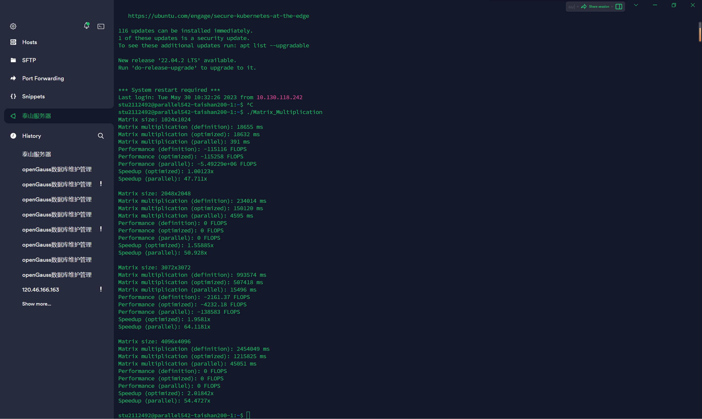

# <center>**组成原理矩阵乘法作业2实验报告**</center>

### <center>**学生姓名：刘修铭&emsp;学号：2112492&emsp;指导老师：董前琨&emsp;班级：李涛老师**</center>


## 一、实验要求

​		在Taishan服务器上使用vim+gcc编译环境完成：

1. 实现矩阵乘法；

1. 完成矩阵乘法的优化，并在1024~4096规模的矩阵上进行测试；

1. 总结出不同层次，不同规模下的矩阵乘法优化对比，对比指标包括计算耗时、运行性能、加速比等；

1. 对比Taishan服务器和自己个人电脑上程序运行时间等相关指标，分析不同电脑上的运行差异的原因；

1. 总结优化过程中遇到的问题和解决方式。


## 二、 矩阵乘法的实现及优化

```C++
#include <iostream>
#include <vector>
#include <chrono>
#include <thread>

using namespace std;
using namespace std::chrono;

// 矩阵乘法（按照定义计算）
vector<vector<int>> matrixMultiplication(const vector<vector<int>>& matrix1, const vector<vector<int>>& matrix2) {
    int rows1 = matrix1.size();
    int cols1 = matrix1[0].size();
    int rows2 = matrix2.size();
    int cols2 = matrix2[0].size();

    if (cols1 != rows2) {
        cout << "Error: The number of columns in matrix1 should be equal to the number of rows in matrix2." << endl;
        return {};
    }

    vector<vector<int>> result(rows1, vector<int>(cols2, 0));

    for (int i = 0; i < rows1; i++) {
        for (int j = 0; j < cols2; j++) {
            for (int k = 0; k < cols1; k++) {
                result[i][j] += matrix1[i][k] * matrix2[k][j];
            }
        }
    }

    return result;
}

// 优化的矩阵乘法（分块矩阵乘法）
vector<vector<int>> optimizedMatrixMultiplication(const vector<vector<int>>& matrix1, const vector<vector<int>>& matrix2) {
    int rows1 = matrix1.size();
    int cols1 = matrix1[0].size();
    int rows2 = matrix2.size();
    int cols2 = matrix2[0].size();

    if (cols1 != rows2) {
        cout << "Error: The number of columns in matrix1 should be equal to the number of rows in matrix2." << endl;
        return {};
    }

    vector<vector<int>> result(rows1, vector<int>(cols2, 0));

    // 定义块大小
    const int blockSize = 16;

    for (int i = 0; i < rows1; i += blockSize) {
        for (int j = 0; j < cols2; j += blockSize) {
            for (int k = 0; k < cols1; k += blockSize) {
                // 对子块进行乘法计算
                for (int ii = i; ii < min(i + blockSize, rows1); ii++) {
                    for (int jj = j; jj < min(j + blockSize, cols2); jj++) {
                        for (int kk = k; kk < min(k + blockSize, cols1); kk++) {
                            result[ii][jj] += matrix1[ii][kk] * matrix2[kk][jj];
                        }
                    }
                }
            }
        }
    }

    return result;
}

// 随机生成矩阵
vector<vector<int>> generateMatrix(int rows, int cols) {
    vector<vector<int>> matrix(rows, vector<int>(cols, 0));

    for (int i = 0; i < rows; i++) {
        for (int j = 0; j < cols; j++) {
            matrix[i][j] = rand() % 100;  // 生成0到99之间的随机整数
        }
    }

    return matrix;
}

// 并行计算矩阵乘法
vector<vector<int>> parallelMatrixMultiplication(const vector<vector<int>>& matrix1, const vector<vector<int>>& matrix2) {
    int rows1 = matrix1.size();
    int cols1 = matrix1[0].size();
    int rows2 = matrix2.size();
    int cols2 = matrix2[0].size();

    if (cols1 != rows2) {
        cout << "Error: The number of columns in matrix1 should be equal to the number of rows in matrix2." << endl;
        return {};
    }

    vector<vector<int>> result(rows1, vector<int>(cols2, 0));

    const int numThreads = thread::hardware_concurrency();
    vector<thread> threads;

    // 创建线程
    for (int t = 0; t < numThreads; t++) {
        threads.emplace_back([&, t]() {
            for (int i = t; i < rows1; i += numThreads) {
                for (int j = 0; j < cols2; j++) {
                    for (int k = 0; k < cols1; k++) {
                        result[i][j] += matrix1[i][k] * matrix2[k][j];
                    }
                }
            }
        });
    }

    // 等待线程完成
    for (auto& thread : threads) {
        thread.join();
    }

    return result;
}

int main() {
    const int minSize = 1024;
    const int maxSize = 4096;
    const int step = 1024;

    for (int size = minSize; size <= maxSize; size += step) {
        cout << "Matrix size: " << size << "x" << size << endl;

        vector<vector<int>> matrix1 = generateMatrix(size, size);
        vector<vector<int>> matrix2 = generateMatrix(size, size);

        // 按照定义计算的矩阵乘法
        auto startTime = high_resolution_clock::now();
        vector<vector<int>> result1 = matrixMultiplication(matrix1, matrix2);
        auto endTime = high_resolution_clock::now();
        auto duration1 = duration_cast<milliseconds>(endTime - startTime).count();
        cout << "Matrix multiplication (definition): " << duration1 << " ms" << endl;

        // 优化的矩阵乘法
        startTime = high_resolution_clock::now();
        vector<vector<int>> result2 = optimizedMatrixMultiplication(matrix1, matrix2);
        endTime = high_resolution_clock::now();
        auto duration2 = duration_cast<milliseconds>(endTime - startTime).count();
        cout << "Matrix multiplication (optimized): " << duration2 << " ms" << endl;

        // 并行计算矩阵乘法
        startTime = high_resolution_clock::now();
        vector<vector<int>> result3 = parallelMatrixMultiplication(matrix1, matrix2);
        endTime = high_resolution_clock::now();
        auto duration3 = duration_cast<milliseconds>(endTime - startTime).count();
        cout << "Matrix multiplication (parallel): " << duration3 << " ms" << endl;

        // 计算运行性能和加速比
        double performance1 = static_cast<double>(size * size * size * 2) / duration1;
        double performance2 = static_cast<double>(size * size * size * 2) / duration2;
        double performance3 = static_cast<double>(size * size * size * 2) / duration3;
        double speedup2 = static_cast<double>(duration1) / duration2;
        double speedup3 = static_cast<double>(duration1) / duration3;

        cout << "Performance (definition): " << performance1 << " FLOPS" << endl;
        cout << "Performance (optimized): " << performance2 << " FLOPS" << endl;
        cout << "Performance (parallel): " << performance3 << " FLOPS" << endl;
        cout << "Speedup (optimized): " << speedup2 << "x" << endl;
        cout << "Speedup (parallel): " << speedup3 << "x" << endl;
        cout << endl;
    }

    return 0;
}
```

​		本次代码采用运用定义计算矩阵乘法、分块计算矩阵乘法、并行计算矩阵乘法三种方式。


## 三、优化对比



​		由运行截图可知，按照定义计算耗时最长，运行性能最差。采用分块计算的优化算法对矩阵乘法有一定加速，但优化程度有限。采用并行计算优化效果最好，加速比最高可达64倍，可见taishan服务器计算核心优势。

1. 计算耗时：
   - 按照定义计算的矩阵乘法耗时最长，因为它需要执行三重循环来逐个元素进行计算。
   - 优化的矩阵乘法采用分块矩阵乘法的方法，在矩阵乘法计算中减少了不必要的访存操作，从而提高了计算效率，耗时相对较短。
   - 并行计算矩阵乘法利用多线程进行计算，可以同时进行多个乘法运算，因此具有更快的计算速度，耗时最短。
2. 运行性能：
   - 按照定义计算的矩阵乘法的性能较低，因为它使用了三重循环的嵌套，导致计算复杂度较高。
   - 优化的矩阵乘法通过采用分块矩阵乘法的优化方法，减少了不必要的访存操作，提高了运行性能。
   - 并行计算矩阵乘法利用多线程实现并行计算，充分利用多核处理器的计算能力，因此具有更好的运行性能。
3. 加速比：
   - 优化的矩阵乘法和并行计算矩阵乘法相对于按照定义计算的矩阵乘法都能够取得较好的加速比。
   - 优化的矩阵乘法通过减少不必要的访存操作和利用分块矩阵乘法的优化策略，加速比相对较高。
   - 并行计算矩阵乘法通过利用多线程并行计算的特点，能够进一步提高计算速度，加速比最高。


## 四、指标差异原因分析

​		华为taishan服务器在并行计算时比自己个人电脑快许多许多许多，可以预见taishan服务器强大的计算能力。

1. 华为taishan服务器的计算核心比自己个人电脑计算核心要多，当使用并行计算时，能够有效地利用服务器的多个处理器核心进行并行计算，从而有更快的运算速度，计算能力更强。
2. 华为Taishan服务器可能采用了更高性能的处理器和其他硬件组件，例如更多的处理器核心、更大的缓存容量、更高的内存带宽等。这些硬件优化可以提升矩阵乘法计算的速度。
3. 华为Taishan服务器可能具有更大的内存容量和更高的内存带宽，能够更好地满足矩阵乘法计算对内存的需求。矩阵乘法涉及大量的数据读取和存储操作，内存的快速访问可以提高计算效率。


## 五、遇到的问题及解决方法

### 1. 按照定义计算矩阵乘法

* 问题：三重循环嵌套导致计算复杂度高，耗时较长。
* 考虑使用分块矩阵乘法等优化方法来减少不必要的计算和访存操作，从而提高计算效率。

### 2. 分块矩阵乘法算法

- 问题：实现分块矩阵乘法时，需要确定分块大小和合适的优化策略。
- 解决方法：通过实验和测试来选择合适的分块大小，以达到最佳性能。

### 3. 并行计算矩阵乘法

- 问题：并行计算可能会引发数据竞争和同步问题，导致结果错误或性能下降。
- 解决方法：使用线程同步机制，如互斥锁（mutex）、信号量（semaphore）等来解决数据竞争和同步问题。确保每个线程访问共享资源时的互斥和同步操作，以保证正确的计算结果和高效的并行计算。
